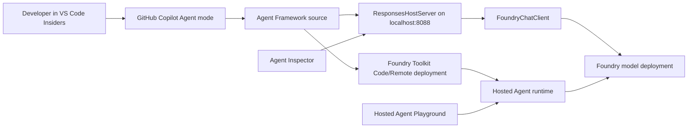
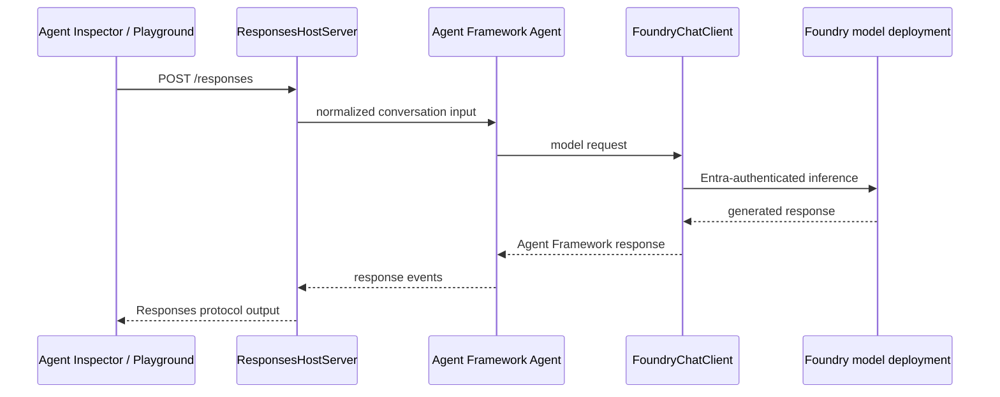

# Build and Deploy Your First Microsoft Foundry Hosted Agent

> A beginner-first, end-to-end tutorial for building an AI agent with Foundry
> Toolkit, GitHub Copilot, Microsoft Agent Framework, and Microsoft Foundry.

[](https://gist.githubusercontent.com/shinyay/56e54ee4c0e22db8211e05e70a63247e/raw/f3ac65a05ed8c8ea70b653875ccac0c6dbc10ba1/LICENSE)

This tutorial starts with an empty repository and finishes with a Python agent
running locally in Agent Inspector and remotely as a Microsoft Foundry Hosted
Agent. It is designed for developers who are new to one or more of the
following:

- Microsoft Foundry and Foundry Agent Service
- Foundry Toolkit for Visual Studio Code
- Microsoft Agent Framework
- GitHub Copilot Agent mode
- Responses protocol and Hosted Agents

> [!NOTE]
> Tutorial 1 was validated on **August 14, 2026** and Tutorial 2 on
> **August 15, 2026**. Foundry Toolkit, Agent Framework, Hosted Agent APIs, and
> preview UI labels evolve quickly. Use the linked Microsoft documentation
> when a label or version has changed.

## Learning Path

| Tutorial | Start here | Outcome |
|---|---|---|
| **1. Basic Hosted Agent** | Continue in this README and use [`basic-hosted-agent/`](basic-hosted-agent/) | Scaffold, customize with GitHub Copilot, debug through Responses, and deploy a first Hosted Agent. |
| **2. Agentic Knowledge Gateway** | [`agentic-knowledge-gateway/README.md`](agentic-knowledge-gateway/README.md) | Add Agent Service Memory, authoritative persistence checks, a seven-day shared tutorial scope, Hosted deployment, and incoming A2A v1.0. |

Tutorial 2 builds directly on the hosting, identity, debugging, and deployment
concepts introduced here. Complete Tutorial 1 first if Foundry Toolkit,
Agent Framework, or Hosted Agents are new to you.

### Companion documents

These sit alongside Tutorial 2 and are written in Japanese.

| Document | Read it when |
|---|---|
| [`agentic-knowledge-gateway/PROMPTS.md`](agentic-knowledge-gateway/PROMPTS.md) | You want to adapt the GitHub Copilot prompts rather than copy them, and need the reasoning behind each constraint. |
| [`agentic-knowledge-gateway/DEMO.md`](agentic-knowledge-gateway/DEMO.md) | You want to demonstrate agent-to-agent memory recall to an audience. |

## What You Will Build

You will create a small conversational agent that:

- uses Microsoft Agent Framework and `FoundryChatClient`;
- exposes the OpenAI-compatible Responses protocol through
  `ResponsesHostServer`;
- authenticates to Microsoft Foundry with Microsoft Entra ID;
- responds in Japanese with one or two hints, a separator, and then the answer,
  as a visible customization example;
- supports a multi-turn conversation;
- runs locally on port `8088`;
- deploys from source code with Remote dependency resolution; and
- runs in Foundry Agent Service as a Hosted Agent.

The completed source is in [`basic-hosted-agent/`](basic-hosted-agent/).
Its project-specific documentation is in
[`basic-hosted-agent/README.md`](basic-hosted-agent/README.md).

## Tool Responsibilities

| Component | Role in this tutorial |
|---|---|
| **GitHub Copilot** | Reviews the generated project, performs bounded edits, prepares the Python environment, and explains each change. |
| **Microsoft Agent Framework** | Implements the agent, model client, instructions, and conversation behavior. |
| **Foundry Toolkit** | Scaffolds the official sample, opens Agent Inspector, selects Foundry resources, deploys the agent, and opens the Hosted Agent playground. |
| **Microsoft Foundry Project** | Provides the project endpoint, model deployment, identity boundary, and agent-management plane. |
| **Foundry Hosted Agent** | Runs the packaged agent code with managed compute, identity, sessions, logs, traces, and scaling. |



## Tested Toolchain

These are tested versions, not permanent minimum versions.

| Tool | Tested version or configuration |
|---|---|
| Windows | Windows 11 with WSL 2 |
| Linux distribution | Ubuntu 24.04 in WSL |
| Editor | Visual Studio Code - Insiders |
| Foundry Toolkit | 1.6.8 |
| Python for local development | 3.12.3 |
| Python for Code-hosted runtime | 3.13 |
| `uv` | 0.10.4 |
| Azure CLI | 2.87.0 |
| Azure Developer CLI (`azd`) | 1.30.0 |
| Hosted protocol | Responses 2.0.0 |
| Local HTTP port | 8088 |

## Tutorial Map

1. [Prepare Windows, WSL, and Azure](#1-prepare-windows-wsl-and-azure)
2. [Install VS Code extensions](#2-install-vs-code-extensions)
3. [Clone and open the repository](#3-clone-and-open-the-repository)
4. [Scaffold the Hosted Agent](#4-scaffold-the-hosted-agent)
5. [Understand the generated project](#5-understand-the-generated-project)
6. [Create the Python environment](#6-create-the-python-environment)
7. [Extend the agent with GitHub Copilot](#7-extend-the-agent-with-github-copilot)
8. [Connect to a Foundry Project and model](#8-connect-to-a-foundry-project-and-model)
9. [Run the agent locally](#9-run-the-agent-locally)
10. [Deploy the Hosted Agent](#10-deploy-the-hosted-agent)
11. [Verify the cloud deployment](#11-verify-the-cloud-deployment)
12. [Troubleshoot common issues](#12-troubleshoot-common-issues)

---

## 1. Prepare Windows, WSL, and Azure

### Local prerequisites

Install or obtain:

- Windows 11 with
  [WSL 2](https://learn.microsoft.com/windows/wsl/install);
- Ubuntu 24.04 or another supported Linux distribution in WSL;
- [Visual Studio Code - Insiders](https://code.visualstudio.com/insiders/);
- [Git](https://git-scm.com/);
- Python 3.12;
- [`uv`](https://docs.astral.sh/uv/);
- [Azure CLI](https://learn.microsoft.com/cli/azure/install-azure-cli);
- [Azure Developer CLI](https://learn.microsoft.com/azure/developer/azure-developer-cli/install-azd);
- an Azure subscription;
- a GitHub account with GitHub Copilot access.

Verify the WSL tools:

```bash
python3.12 --version
uv --version
git --version
az version
azd version
```

Sign in from WSL:

```bash
az login
azd auth login
```

### Foundry prerequisites

The primary path assumes that you already have:

1. a Microsoft Foundry Project; and
2. a chat-capable model deployment in that Project's Foundry resource.

Record these reusable values:

| Placeholder | Example shape |
|---|---|
| `<foundry-project-endpoint>` | `https://<account>.services.ai.azure.com/api/projects/<project>` |
| `<model-deployment-name>` | The deployment name shown under **Models**, not necessarily the model-family name |
| `<hosted-agent-name>` | A unique name such as `my-first-hosted-agent` |
| `<azure-subscription>` | The subscription selected in Foundry Toolkit |

Agent names must start and end with an alphanumeric character, can contain
hyphens, and must be at most 63 characters.

> [!IMPORTANT]
> Use the **deployment name** for `<model-deployment-name>`. A deployment named
> `my-gpt-deployment` can point to a model family with a different catalog name.

### If you do not have a Foundry Project or model

Use one of these supported paths before continuing:

1. In Foundry Toolkit, select **My Resources** → **Set Foundry Project** →
   **Create project**.
2. Follow the wizard to choose a subscription, resource group, region, and
   Project.
3. Open **Models** or **Developer Tools** → **Discover** → **Model Catalog**.
4. Choose a chat-capable model and deploy it.
5. Return to **Set Foundry Project** and select the new Project.

For the full resource workflow, see:

- [Create a Foundry Project](https://learn.microsoft.com/azure/foundry/how-to/create-projects)
- [Set up Foundry resources](https://learn.microsoft.com/azure/foundry/tutorials/quickstart-create-foundry-resources)
- [Deploy Foundry Models](https://learn.microsoft.com/azure/foundry/foundry-models/how-to/deploy-foundry-models)

Your organization may require an administrator to grant roles. In typical
development scenarios, **Foundry User** supports agent development and
invocation, while project administration or model deployment can require
**Foundry Project Manager**, **Foundry Owner**, Contributor, or another
organization-approved role at the correct scope. See
[Foundry RBAC](https://learn.microsoft.com/azure/foundry/concepts/rbac-foundry)
and the
[Hosted Agent permissions reference](https://learn.microsoft.com/azure/foundry/agents/concepts/hosted-agent-permissions).

### macOS and Linux

The agent code, `uv`, Azure CLI, and `azd` commands are the same. Use regular
Visual Studio Code instead of a WSL window, and replace WSL-specific paths such
as `/home/<user>/...` with your native workspace path.

---

## 2. Install VS Code Extensions

Open VS Code Insiders in the WSL distribution, then open the Extensions view
with `Ctrl+Shift+X`.

### Foundry Toolkit

1. Search for
   [**Foundry Toolkit**](https://marketplace.visualstudio.com/items?itemName=ms-windows-ai-studio.windows-ai-studio).
2. Install the Microsoft extension.
3. Confirm that the Foundry Toolkit icon appears in the Activity Bar.
4. Open it and confirm that these areas are visible:
   - **My Resources**
   - **Developer Tools**
   - **Build**
   - **Create Agent**
   - **Agent Inspector**
   - **Deploy Hosted Agent**

Optional CLI installation:

```powershell
code-insiders --install-extension ms-windows-ai-studio.windows-ai-studio
```

### Python

Install the
[Microsoft Python extension](https://marketplace.visualstudio.com/items?itemName=ms-python.python).
The generated debug workflow uses the selected Python interpreter and
`debugpy`.

```powershell
code-insiders --install-extension ms-python.python
```

### GitHub Copilot

1. Search for
   [**GitHub Copilot**](https://marketplace.visualstudio.com/items?itemName=GitHub.copilot)
   in the Extensions view.
2. Install or enable it.
3. Open the Chat view.
4. Sign in to GitHub when prompted.
5. Confirm that the chat composer can be switched to **Agent** mode.

See [Set up GitHub Copilot in VS Code](https://code.visualstudio.com/docs/setup/copilot).

### Azure sign-in

Foundry Toolkit and Azure CLI authentication are related but separate user
experiences. Confirm that:

- `az account show` works in the WSL terminal;
- `azd auth login --check-status` reports a signed-in account; and
- Foundry Toolkit can open **Set Foundry Project**.

---

## 3. Clone and Open the Repository

From WSL:

```bash
mkdir -p ~/work/github
cd ~/work/github
git clone https://github.com/shinyay/getting-started-with-foundry-toolkit-in-practice.git
cd getting-started-with-foundry-toolkit-in-practice
code-insiders .
```

Confirm that the lower-left VS Code status area shows a WSL connection such as
`WSL: Ubuntu-24.04`.

---

## 4. Scaffold the Hosted Agent

Foundry Toolkit provides a current, supported sample instead of requiring you to
assemble the hosting protocol manually.

1. Open the Foundry Toolkit view.
2. Select **Developer Tools** → **Build** → **Create Agent**.
3. Under **Create in code with full control**, select **Use a sample**.
4. Select **Basic Hosted Agent** with these tags:
   - **Python**
   - **Agent Framework**
   - **Responses**
5. Select **Next**.
6. On the Create page:
   - **Workspace Folder**: the current repository;
   - **Folder Name**: `basic-hosted-agent`;
   - **Environment Setup**: **Skip for now**.
7. Select **Create**.
8. Open `basic-hosted-agent` as the VS Code workspace root when generation
   finishes.

Skipping environment setup keeps scaffolding independent from Azure resource
selection. You will configure a known Project and model after reviewing the
generated code.

For this first tutorial, use **Use a sample** rather than **Generate with
Copilot** or **Open Agent Builder**. The official sample establishes a known
hosting adapter, protocol, entry point, and deployment manifest; GitHub Copilot
is then used for controlled customization.

### Why this sample?

- **Python** gives a small, readable implementation.
- **Agent Framework** is Microsoft's agent SDK and orchestration layer.
- **Responses** provides a standard conversational contract, streaming,
  multi-turn history, and Foundry hosting compatibility.
- **Basic Hosted Agent** is the shortest path to a successful local and cloud
  round trip.

---

## 5. Understand the Generated Project

The scaffold plus the safety and metadata files added later in this tutorial
will have this structure:

```text
basic-hosted-agent/
├── .foundry/
│   ├── agent-metadata.yaml
│   ├── datasets/
│   ├── evaluators/
│   └── results/
├── .vscode/
│   ├── launch.json
│   ├── settings.json
│   └── tasks.json
├── src/
│   └── agent-framework-agent-basic-responses/
│       ├── .azdignore
│       ├── .dockerignore
│       ├── .env
│       ├── .env.example
│       ├── Dockerfile
│       ├── main.py
│       └── requirements.txt
├── .gitignore
├── AGENTS.md
├── azure.yaml
└── README.md
```

Immediately after scaffolding, `.gitignore`, `.env.example`,
`.foundry/agent-metadata.yaml`, and the three `.foundry` cache directories might
not exist yet. The Copilot and post-deployment steps create them explicitly.

| File | Purpose |
|---|---|
| `main.py` | Creates `FoundryChatClient`, the Agent Framework `Agent`, and `ResponsesHostServer`. |
| `requirements.txt` | Installs Agent Framework, Foundry hosting adapter, and debugger dependencies. |
| `.env` | Local Project endpoint and model deployment. It must remain ignored by Git. |
| `.env.example` | Safe template containing variable names but no environment-specific values. |
| `azure.yaml` | Defines the Foundry Project reference, Hosted Agent package, runtime, protocol, environment variables, and compute size. |
| `.vscode/tasks.json` | Starts the HTTP server under `debugpy` and opens Agent Inspector. |
| `.foundry/agent-metadata.yaml` | Records reusable environment-to-Agent mappings for later evaluation and tracing workflows. |
| `.azdignore` | Excludes local files such as `.env` from Code-package deployment. |
| `Dockerfile` | Optional Container deployment path; it is not used in the Code/Remote walkthrough. |

The runtime path is:



---

## 6. Create the Python Environment

From the `basic-hosted-agent` workspace root:

```bash
uv venv --python 3.12 .venv
uv pip install \
  --python .venv/bin/python \
  -r src/agent-framework-agent-basic-responses/requirements.txt
```

Verify Python and imports:

```bash
.venv/bin/python --version
.venv/bin/python -c \
  "import agent_framework, agent_framework_foundry_hosting, azure.identity, dotenv; print('imports: ok')"
```

In VS Code:

1. Press `Ctrl+Shift+P`.
2. Run **Python: Select Interpreter**.
3. Select `.venv/bin/python`.

> [!IMPORTANT]
> Seeing `Python 3.12` in the status bar is not enough. F5 must use the
> interpreter whose full path ends in `basic-hosted-agent/.venv/bin/python`.

### Why local Python 3.12 and hosted Python 3.13?

The local environment and optional Dockerfile use Python 3.12. The current
official Code-package manifest uses the Foundry-managed `python_3_13` runtime.
This is intentional. If the hosted runtime must also be Python 3.12, use the
Container deployment path and provide a Linux AMD64 image.

---

## 7. Extend the Agent with GitHub Copilot

The goal is not to let Copilot make unrestricted changes. Give it explicit
boundaries, preserve the hosting contract, and review every diff.

Open GitHub Copilot Chat, select **Agent** mode, and submit the following prompt:

```text
This workspace is the official Microsoft Foundry Basic Hosted Agent sample.
Keep Python 3.12 for local development, Microsoft Agent Framework, and the
Responses protocol.

Make only these changes:

1. In src/agent-framework-agent-basic-responses/main.py:
   - call load_dotenv(override=False);
   - add -> None to main;
   - change the Agent instructions so the assistant answers briefly and
     accurately in Japanese and does not guess when it does not know;
   - do not change ResponsesHostServer, DefaultAzureCredential, store=False,
     the environment variable names, or port behavior.
2. Add a Python .gitignore at the workspace root. At minimum ignore .venv/,
   __pycache__/, *.py[cod], .env, .pytest_cache/, .ruff_cache/, and .azure/.
3. Add src/agent-framework-agent-basic-responses/.env.example containing empty
   FOUNDRY_PROJECT_ENDPOINT and AZURE_AI_MODEL_DEPLOYMENT_NAME entries.
4. Do not change azure.yaml, Dockerfile, requirements.txt, Responses protocol,
   or port 8088 yet.

Before editing, show a short plan. After editing, summarize the diff and confirm
that the syntax is valid on Python 3.12.
```

Review that Copilot made the intended changes:

```python
load_dotenv(override=False)


def main() -> None:
    ...
    agent = Agent(
        client=client,
        instructions=AGENT_INSTRUCTIONS,
        default_options={"store": False},
    )
```

`override=False` is important: Foundry-injected environment variables take
precedence over values in a local `.env` file.

### Optional Copilot prompt for environment setup

```text
Prepare this WSL workspace for local development:

- create .venv at the workspace root with uv and Python 3.12;
- install src/agent-framework-agent-basic-responses/requirements.txt into it;
- verify the selected Python is 3.12;
- verify imports for agent_framework, agent_framework_foundry_hosting,
  azure.identity, and dotenv;
- do not modify dependency files or source files;
- do not start the Agent server.

Summarize the commands and results.
```

### Copilot review checklist

Before accepting edits, verify that Copilot did not:

- add credentials or keys;
- commit or expose `.env`;
- replace `DefaultAzureCredential` with an API key;
- change the Responses protocol;
- remove `default_options={"store": False}`;
- change port `8088`;
- provision Azure resources; or
- edit unrelated files.

---

## 8. Connect to a Foundry Project and Model

### Select the Project in Foundry Toolkit

1. Open Foundry Toolkit.
2. Select **My Resources** → **Set Foundry Project**.
3. Select **Switch project**.
4. Select `<azure-subscription>`.
5. Select the desired Foundry Project.
6. Expand **Models** and confirm that `<model-deployment-name>` exists and is
   active.

The Toolkit Project selection and the `azd` environment are separate contexts.
Configure both.

### Configure local environment variables

```bash
cd src/agent-framework-agent-basic-responses
cp .env.example .env
```

Edit `.env`:

```dotenv
FOUNDRY_PROJECT_ENDPOINT=<foundry-project-endpoint>
AZURE_AI_MODEL_DEPLOYMENT_NAME=<model-deployment-name>
```

Return to the workspace root:

```bash
cd ../..
```

Never commit `.env`.

### Configure `azd`

Replace the values before running these commands:

```bash
export FOUNDRY_PROJECT_ENDPOINT="<foundry-project-endpoint>"
export AZURE_AI_MODEL_DEPLOYMENT_NAME="<model-deployment-name>"

azd ai project set "$FOUNDRY_PROJECT_ENDPOINT"
azd env new dev --no-prompt
azd env set \
  FOUNDRY_PROJECT_ENDPOINT \
  "$FOUNDRY_PROJECT_ENDPOINT" \
  -e dev
azd env set \
  AZURE_AI_MODEL_DEPLOYMENT_NAME \
  "$AZURE_AI_MODEL_DEPLOYMENT_NAME" \
  -e dev
azd env get-values -e dev
```

If `dev` already exists, select it instead:

```bash
azd env select dev
```

The `.azure/` directory contains local `azd` state and is ignored.

### Adapt `azure.yaml` for an existing Project

When reusing an existing Project and model:

1. add the existing Project endpoint to the `azure.ai.project` service;
2. remove the generated `deployments:` block so the tutorial does not declare a
   duplicate model deployment;
3. set the Hosted Agent name; and
4. keep the model deployment as an environment-variable reference.

Illustrative structure:

```yaml
services:
  ai-project:
    host: azure.ai.project
    endpoint: <foundry-project-endpoint>

  hosted-agent-service:
    host: azure.ai.agent
    project: src/agent-framework-agent-basic-responses
    language: python
    codeConfiguration:
      runtime: python_3_13
      entryPoint: main.py
      dependencyResolution: remote_build
    uses:
      - ai-project
    kind: hosted
    name: <hosted-agent-name>
    protocols:
      - protocol: responses
        version: 2.0.0
    environmentVariables:
      - name: AZURE_AI_MODEL_DEPLOYMENT_NAME
        value: ${AZURE_AI_MODEL_DEPLOYMENT_NAME}
    container:
      resources:
        cpu: "0.5"
        memory: 1.0Gi
```

### Bounded Copilot prompt for deployment configuration

```text
Update this Hosted Agent for an existing Microsoft Foundry Project.

Before running this prompt, replace:
- <foundry-project-endpoint>
- <hosted-agent-name>
- <model-deployment-name>

1. In azure.yaml, add <foundry-project-endpoint> to the ai-project service.
2. Remove the ai-project deployments block. Reuse the existing model instead
   of declaring a new deployment.
3. Set the Hosted Agent name to <hosted-agent-name>.
4. Preserve the source path, python_3_13 runtime, main.py entry point,
   remote_build dependency resolution, Responses 2.0.0, environment variable
   reference, CPU, and memory.
5. Create or select the non-interactive azd environment dev.
6. Set FOUNDRY_PROJECT_ENDPOINT=<foundry-project-endpoint> and
   AZURE_AI_MODEL_DEPLOYMENT_NAME=<model-deployment-name> in dev.
7. Run azd env get-values -e dev and azd ai agent doctor --local-only -e dev.
8. Do not run provision, deploy, or up.

Show the exact azure.yaml diff and report any diagnostic warning.
```

Run the local-only diagnostic:

```bash
azd ai agent doctor --local-only -e dev --no-prompt
```

---

## 9. Run the Agent Locally

### Start F5 debugging

1. Confirm `.venv/bin/python` is selected.
2. Press `F5`.
3. Select **Debug Local Agent HTTP Server** if VS Code asks.
4. Wait for Agent Inspector to open.
5. Confirm:
   - status: **Connected**;
   - endpoint: `http://localhost:8088`;
   - protocol: **Responses Protocol**.

The generated VS Code task:

- validates ports `5679` and `8088`;
- verifies `debugpy`;
- starts `main.py` under the debugger;
- opens Agent Inspector.

### Find the input box

In Agent Inspector, select **Playground**. If the Terminal panel obscures the
page, press `Ctrl+J` to hide it. The input is at the lower left and displays
`Type a message...`.

### Single-turn smoke test

```text
二分探索の計算量はどれくらいですか。
```

Expected outcome: one or two hints, a `---` separator, and then `O(log n)` with
a short reason. The hints appear first because of the customized instructions.

### Multi-turn smoke test

Without clearing the conversation, send:

```text
それを一言でまとめてください。
```

Expected outcome: the second response builds on the previous answer. This
confirms that the Responses conversation context is working.

### Abstention smoke test

```text
Project Shinya の本番デプロイ枠を教えてください。
```

Expected outcome: the agent states that it does not know rather than inventing
a schedule. This agent has no knowledge store of its own.

Inspect **Input & Output** and **Events** to understand the request lifecycle.

Stop the local server with `Shift+F5` before deployment.

### Manual alternative

```bash
cd src/agent-framework-agent-basic-responses
../../.venv/bin/python main.py
```

Then open **Foundry Toolkit: Open Agent Inspector** and connect to port `8088`.

---

## 10. Deploy the Hosted Agent

### Why Code + Remote?

| Method | Dependency handling | Runtime control | Best use |
|---|---|---|---|
| **Code + Remote** | Azure installs `requirements.txt` during provisioning | Foundry-managed Python runtime | Fastest beginner path; used here |
| **Code + Bundled** | Dependencies are included in the uploaded package | Foundry-managed runtime | Reproducible offline package or custom build output |
| **Container** | Dependencies are baked into an image in ACR | Full OS and Python control | Native libraries, custom system packages, strict Python 3.12 hosting |

Container deployment requires a Linux AMD64 image, Azure Container Registry,
and correct pull permissions for the Hosted Agent identity. It is intentionally
outside this first tutorial.

### Open the deployment wizard

1. In Agent Inspector, select **Deploy**, or run
   **Foundry Toolkit: Deploy Hosted Agent** from the Command Palette.
2. On **Basics**, select:
   - **Deployment Method**: **Code**
   - **Package Mode**: **Remote**
   - **Deploy to**: **New agent**
   - **Hosted Agent Name**: `<hosted-agent-name>`
3. Select **Next**.
4. On **Review + Deploy**, confirm:
   - **Language**: Python
   - **Runtime Version**: Python 3.13
   - **Entry Point**: `python main.py`
   - **CPU and Memory**: `0.5 CPU / 1.0 Gi`
5. Select **Deploy**.

> [!WARNING]
> Deployment creates billable Azure runtime resources. Use the smallest
> practical compute size for a tutorial and remove resources you no longer
> need.

Wait for the success notification and for the Hosted Agent version to become
active. The Toolkit opens **Hosted agent playground** after a successful
deployment.

---

## 11. Verify the Cloud Deployment

At the top of Hosted Agent Playground, confirm:

- `<hosted-agent-name>` is selected;
- protocol is **Responses**;
- an active version is available; and
- a session has been created.

Repeat the same tests used locally.

First turn:

```text
Explain the difference between Microsoft Agent Framework and a Hosted Agent in
exactly two sentences, in Japanese.
```

Follow-up:

```text
Rewrite that explanation as a restaurant analogy in one sentence.
```

Success means:

- the first response is returned by the cloud-hosted code;
- the answer follows the customized Japanese instructions; and
- the second response uses the first turn's context.

Use the tabs for:

| Tab | Purpose |
|---|---|
| **Sessions** | Inspect sticky Hosted Agent sessions and their requests. |
| **Traces** | Follow model, host, and tool spans when observability is configured. |
| **Evaluation** | Run quality and safety evaluators against datasets. |
| **Optimize** | Iterate on instructions using evaluation evidence. |

### Expected `disableLocalAuth` warning

You may see a Toolkit output warning similar to:

```text
Failed to list keys ... disableLocalAuth is set to true
```

This does not mean the Hosted Agent deployment failed. It means local key
authentication is disabled on the Foundry resource. This tutorial uses Entra ID
and managed identity instead of account keys.

### Persist deployment metadata

Keep environment-specific workflow metadata under `.foundry/`. Use placeholders
in documentation and real values only in your local project metadata:

```yaml
defaultEnvironment: dev
environments:
  dev:
    projectEndpoint: <foundry-project-endpoint>
    agentName: <hosted-agent-name>
    testCases: []
```

Do not add `azureContainerRegistry` for Code-package deployment because no ACR
is used.

You can ask Copilot to create the metadata with this bounded prompt:

```text
Persist the successful Code/Remote Hosted Agent deployment locally.

Before running this prompt, replace <foundry-project-endpoint> and
<hosted-agent-name>.

1. Do not modify .foundry/.deployment.json.
2. Create .foundry/agent-metadata.yaml with defaultEnvironment dev, the
   placeholder-replaced projectEndpoint and agentName, and testCases: [].
3. Create .foundry/datasets/, .foundry/evaluators/, and .foundry/results/ with
   .gitkeep files.
4. Do not add azureContainerRegistry because this is Code/ZIP deployment.
5. Do not call Azure APIs or deploy anything.
6. Read the YAML back and report the exact files added.
```

---

## 12. Troubleshoot Common Issues

| Symptom | Cause | Resolution |
|---|---|---|
| Foundry Toolkit icon is missing | Extension is not installed in the WSL extension host | Reopen the Extensions view while connected to WSL and install Foundry Toolkit there. |
| Copilot Chat is unavailable | Copilot is disabled, not installed, or not signed in | Enable GitHub Copilot, sign in to GitHub, and confirm Agent mode is available. |
| Project picker stays on `Loading...` | Resource enumeration is still running or Azure auth is stale | Wait briefly, refresh Toolkit, then confirm `az account show` and sign in again if needed. |
| F5 says `debugpy` is not installed and shows `/usr/bin/python3` | VS Code selected the system interpreter | Select `basic-hosted-agent/.venv/bin/python`, then press F5 again. |
| Port 5679 or 8088 is occupied | A previous debug task or server is still running | Stop the previous task with `Shift+F5`; terminate only the process that owns the port. |
| `FOUNDRY_PROJECT_ENDPOINT` is missing | `.env` was not created or the wrong workspace is open | Copy `.env.example` to `.env`, fill it, and open `basic-hosted-agent` as the workspace root. |
| Model deployment is not configured | The deployment name is blank or uses the catalog model name | Set `AZURE_AI_MODEL_DEPLOYMENT_NAME` to the actual deployment name shown in Foundry. |
| Model not found or unauthorized | Wrong Project/model combination or insufficient RBAC | Confirm Toolkit Project selection, model deployment, `azd` environment, and Foundry roles. |
| Local request returns a credential error | Azure CLI token is missing or expired | Run `az login` and `azd auth login`, then retry. |
| Deployment remains provisioning | Remote dependency build or runtime startup is still in progress | Wait, refresh the agent version, and inspect the Toolkit output/logs before retrying. |
| Hosted invocation returns 403 | Hosted Agent identity or user lacks required access | Ask an administrator to verify Foundry Project and Cognitive Services role assignments. |
| Toolkit cannot list account keys | `disableLocalAuth` is enabled | Expected with Entra ID. Ignore it when deployment and invocation succeed. |
| F5 starts but Inspector does not open | The server task succeeded but the Toolkit command did not focus | Run **Foundry Toolkit: Open Agent Inspector** and connect to port 8088. |

For deeper diagnostics:

```bash
azd ai agent doctor --local-only -e dev --no-prompt
```

---

## Security and Configuration Rules

- Never commit `.env`, `.azure/`, access tokens, API keys, or connection
  strings.
- Keep `.env.example` empty.
- Use `load_dotenv(override=False)` so platform-injected values win.
- Use `DefaultAzureCredential` for the supported local-to-hosted identity chain.
- Prefer Entra ID and managed identities over model or account keys.
- Use least-privilege Azure roles.
- Review Copilot diffs before accepting them.
- Before using Container deployment, ensure `.env` is also excluded by
  `.dockerignore`.

## Cleanup and Cost Control

When the tutorial is no longer needed:

1. Open Foundry Toolkit → **My Resources** → **Agents**.
2. Select the tutorial Hosted Agent.
3. Delete the Hosted Agent or unused version after confirming it is not shared.
4. Delete a tutorial-only model deployment if no other application uses it.
5. Delete a tutorial-only Foundry Project/resource group only after reviewing
   every contained resource.
6. Remove the local virtual environment if desired:

   ```bash
   rm -rf .venv
   ```

Do not delete a shared Project, model deployment, or resource group.

## Next Steps

After the basic round trip works:

1. Complete
   [Tutorial 2: Agentic Knowledge Gateway](agentic-knowledge-gateway/README.md)
   to add Agent Service Memory and incoming A2A v1.0.
2. Replace Tutorial 2's shared scope with a trusted identity-to-scope policy
   and validate OBO plus two-user isolation.
3. Add MCP-backed adapters and Foundry Toolbox.
4. Connect Foundry IQ, Azure AI Search, SQL, Cosmos DB, or graph knowledge
   sources.
5. Capture traces and latency.
6. Run relevance, task-adherence, safety, and stateful Memory evaluations.
7. Optimize Agent instructions from evaluation evidence.
8. Add CI/CD for repeatable Hosted Agent deployment and RBAC.

## Official References

| Topic | Documentation |
|---|---|
| Foundry Toolkit | [Work with Foundry projects in VS Code](https://learn.microsoft.com/azure/foundry/how-to/develop/get-started-projects-vs-code) |
| Foundry Toolkit overview | [Foundry Toolkit for VS Code](https://learn.microsoft.com/windows/ai/toolkit/) |
| GitHub Copilot in VS Code | [Set up GitHub Copilot](https://code.visualstudio.com/docs/setup/copilot) |
| Microsoft Agent Framework | [Agent Framework documentation](https://learn.microsoft.com/agent-framework/) |
| First Agent Framework agent | [Your first agent](https://learn.microsoft.com/agent-framework/get-started/your-first-agent) |
| Agent Framework Hosted Agents | [Host Agent Framework agents in Foundry](https://learn.microsoft.com/azure/foundry/how-to/develop/framework-hosted-agents) |
| Hosted Agent concepts | [Foundry Hosted Agents](https://learn.microsoft.com/azure/foundry/agents/concepts/hosted-agents) |
| Deploy from source code | [Deploy a Hosted Agent from code](https://learn.microsoft.com/azure/foundry/agents/how-to/deploy-hosted-agent-code) |
| Hosted Agent quickstart | [Deploy your first Hosted Agent](https://learn.microsoft.com/azure/foundry/agents/quickstarts/quickstart-hosted-agent) |
| Hosted Agent Memory quickstart | [Give a Hosted Agent persistent Memory](https://learn.microsoft.com/azure/foundry/agents/quickstarts/quickstart-memory-hosted-agent) |
| Memory in Agent Service | [Create and use Memory](https://learn.microsoft.com/azure/foundry/agents/how-to/memory-usage) |
| A2A protocol | [A2A specification](https://a2a-protocol.org/latest/specification/) |
| Foundry Project creation | [Create a Foundry Project](https://learn.microsoft.com/azure/foundry/how-to/create-projects) |
| Model deployment | [Deploy Foundry Models](https://learn.microsoft.com/azure/foundry/foundry-models/how-to/deploy-foundry-models) |
| Official samples | [microsoft-foundry/foundry-samples](https://github.com/microsoft-foundry/foundry-samples/tree/main/samples/python/hosted-agents/agent-framework/responses) |

## License

Released under the [MIT license](https://gist.githubusercontent.com/shinyay/56e54ee4c0e22db8211e05e70a63247e/raw/f3ac65a05ed8c8ea70b653875ccac0c6dbc10ba1/LICENSE).

## Author

- GitHub: <https://github.com/shinyay>
- Bluesky: <https://bsky.app/profile/yanashin.bsky.social>
- X: <https://twitter.com/yanashin18618>
- Mastodon: <https://mastodon.social/@yanashin>
- LinkedIn: <https://www.linkedin.com/in/shinyay/>
