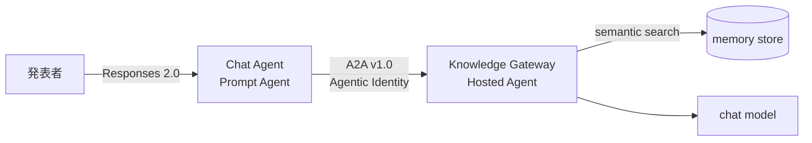

# Agentic Knowledge Gateway デモ実施手順

Foundry Agent Service の Memory にだけ存在する組織固有の知識を、Chat Agent が
A2A 経由で Knowledge Gateway に問い合わせて回答する様子を実演するための手順書です。

> [!NOTE]
> この手順は 2026 年 8 月 18 日に East US 2 で検証しました。Agent Service の Memory、
> Hosted Agent、incoming A2A、Prompt Agent の A2A ツールはいずれもプレビュー
> 機能です。UI のラベルや API の形は変わる可能性があります。

> [!CAUTION]
> デモに使うのは架空の企業と架空プロジェクトの合成データだけです。実在の顧客
> データ、認証情報、個人情報は投入しないでください。この構成のスコープは共有
> 状態であり、利用者ごとの分離境界ではありません。

## 1. このデモで見せられること

| 見せられること | 見せられないこと |
|---|---|
| Agent が別の Agent を A2A v1.0 で呼び出す | OBO による利用者単位の権限委譲 |
| 呼び出された Gateway が長期記憶を検索して答える | 利用者ごとの記憶の分離 |
| 学習データに存在しない組織固有の知識の再現 | 本番運用相当の可用性やスループット |
| 記録がない質問への正直な「記録がありません」 | 本番の保持ポリシーやコンプライアンス統制 |

## 2. 構成



| 要素 | 種別 | 役割 |
|---|---|---|
| Chat Agent | Prompt Agent | 対話窓口。この架空チームに関する知識を持たず、該当する質問を Gateway に委譲する |
| A2A 接続 | RemoteA2A Connection | Chat Agent から Gateway への接続。Agentic Identity で認証 |
| Knowledge Gateway | Hosted Agent | 知識ゲートウェイ本体。Responses 2.0 と incoming A2A v1.0 を公開 |
| Memory store | Agent Service Memory | 長期記憶。既定 TTL は 7 日 |
| チャットモデル | Model Deployment | 両 Agent の推論 |
| 埋め込みモデル | Model Deployment | Memory の意味検索 |

Chat Agent と Gateway はそれぞれ独立したマネージド ID を持ち、Chat Agent 自身の
ID で Gateway を呼び出します。

## 3. 前提

### 3.1 必要なもの

- [`README.md`](README.md) の手順で構築した Gateway 一式
  - Foundry Project、チャットモデル、埋め込みモデル
  - Memory Store
  - Hosted Agent（Responses 2.0 稼働済み、incoming A2A v1.0 設定済み）
- Visual Studio Code - Insiders と Foundry Toolkit
- WSL 上の作業ディレクトリと Python 仮想環境
- `az login` と `azd auth login` を済ませた開発者 ID

### 3.2 作業ディレクトリ

このリポジトリには二つの基準ディレクトリがあります。

| 呼び方 | 位置 |
|---|---|
| Gateway ルート | `<repository-root>/agentic-knowledge-gateway` |
| サービスディレクトリ | Gateway ルート配下の `src/agent-framework-agent-foundry-memory-responses` |

`azd` のコマンドは Gateway ルートで、Python のスクリプトはサービスディレクトリで
実行します。各コマンドの前に、どちらで実行するかを明記します。

サービスディレクトリからは仮想環境の Python を `../../.venv/bin/python` として
参照します。

### 3.3 環境変数

`.env` に Gateway と同じ設定が入っていることを確認します。値は
`azd env get-values` から取得できます。

```dotenv
FOUNDRY_PROJECT_ENDPOINT="https://<account>.services.ai.azure.com/api/projects/<project>"
AZURE_AI_MODEL_DEPLOYMENT_NAME="<chat-deployment>"
AZURE_AI_EMBEDDING_MODEL_DEPLOYMENT_NAME="<embedding-deployment>"
MEMORY_STORE_NAME="<memory-store>"
MEMORY_SCOPE="<memory-scope>"
FOUNDRY_HOSTED_AGENT_NAME="<gateway-agent>"
```

`.env` は追跡対象外です。コミットしないでください。

### 3.4 Foundry Toolkit の既定プロジェクト

削除済みプロジェクトが既定として残っていると Agent 一覧が読み込めません。
症状が出たら次の順序で解消します。

1. `Ctrl+Shift+P` → `Foundry Toolkit: Clear Default Project`
2. `Ctrl+Shift+P` → `Developer: Reload Window`
3. `Ctrl+Shift+P` → `Foundry Toolkit: Set Default Project`

順序が重要です。先に再読み込みするとキャッシュが残ることがあります。

## 4. Chat Agent の構築

Gateway だけでは対話窓口がありません。ここで Chat Agent を作ります。この作業は
初回とデモ環境を作り直したときだけ必要です。

### 4.1 A2A 接続を作る

Gateway の incoming A2A エンドポイントを指す接続を作ります。**Gateway ルート**で
実行します。

```bash
cd <repository-root>/agentic-knowledge-gateway

PROJECT_ENDPOINT="$(azd env get-value FOUNDRY_PROJECT_ENDPOINT)"
GATEWAY_AGENT="$(azd env get-value FOUNDRY_HOSTED_AGENT_NAME)"

azd ai connection create gateway-a2a \
  --kind remote-a2a \
  --target "${PROJECT_ENDPOINT}/agents/${GATEWAY_AGENT}/endpoint/protocols/a2a" \
  --auth-type agentic-identity \
  --audience "https://ai.azure.com" \
  --force
```

> [!IMPORTANT]
> `--metadata AgentCardPath=...` を指定してはいけません。呼び出し先が Foundry の
> Agent の場合、既定のカードパスに任せる必要があります。指定すると実行時に
> `Agent card path is invalid for a Foundry agent` で失敗します。

作成した接続を確認します。

```bash
azd ai connection show gateway-a2a --output json
```

`kind` が `RemoteA2A`、`authType` が `AgenticIdentityToken` であれば正常です。

### 4.2 Chat Agent を発行する

Foundry Toolkit の Prompt Agent 用ツールピッカーは、現行バージョンでは A2A 接続を
一覧に出しません。そのため、この Agent は Foundry のデータプレーン API から
構成します。**サービスディレクトリ**で実行します。

```bash
cd <repository-root>/agentic-knowledge-gateway/src/agent-framework-agent-foundry-memory-responses

../../.venv/bin/python -m scripts.publish_demo_chat_agent \
  --chat-agent-name knowledge-chat-agent \
  --connection-name gateway-a2a
```

引数を省略すると、環境変数 `DEMO_CHAT_AGENT_NAME` と
`DEMO_A2A_CONNECTION_NAME`、それも無ければ上記と同じ既定値を使います。名前を
取り違えないよう、手順では明示的に指定しています。

スクリプトは接続の種別とメタデータを検証してから発行し、成功すると発行された
バージョン番号を表示します。実行するたびに新しいバージョンが作られるため、
デモ前に毎回実行する必要はありません。構成を変更したときだけ実行してください。

このスクリプトが Agent に与える指示は次の方針です。

- 自分の知識を持たず、Gateway だけを情報源とする
- 該当する質問では、同じターン内で必ずツールを呼ぶ
- 実行してよいか利用者に尋ねない
- 質問文を要約せずそのまま Gateway に渡す
- 一度で見つからなければ主要な語句で再検索する
- 生の JSON を利用者に見せない
- 見つからなければ推測せず「記録がありません」と答える

### 4.3 Chat Agent に権限を与える

Chat Agent は自身のマネージド ID で Gateway を呼びます。初回のみロールを割り当て
ます。ポータルまたは `az role assignment create` で、Chat Agent のインスタンス ID に
対して次を付与してください。

| スコープ | ロール | 用途 |
|---|---|---|
| Foundry Project | Foundry User | プロジェクトのデータプレーン利用 |
| Foundry アカウント | Cognitive Services User | Agent の呼び出し |
| Foundry アカウント | Cognitive Services OpenAI User | モデルの利用 |

ロールの反映には数分かかります。直後に呼び出すと権限エラーになることがあります。

## 5. デモ用知識の投入

### 5.1 実行

デモ開始の直前に、**サービスディレクトリ**から実行します。

```bash
cd <repository-root>/agentic-knowledge-gateway/src/agent-framework-agent-foundry-memory-responses

../../.venv/bin/python -m scripts.cleanup_memory --scope --yes
../../.venv/bin/python -m scripts.seed_demo_knowledge
```

投入後、埋め込みの索引付けが終わるまで 2 分ほど待ちます。

```bash
sleep 120
```

中身は次で確認できます。

```bash
../../.venv/bin/python -m scripts.list_memory
```

7 件が並べば準備完了です。

### 5.2 なぜ毎回リセットするのか

Gateway は会話のたびに、利用者の傾向を要約した項目を Memory に自動追記します。
これが溜まると意味検索の上位候補を奪い、事実そのものが返らなくなります。

デモ直前にスコープを初期化すると、想定した 7 件だけが検索対象になり、再現性が
安定します。

### 5.3 投入される知識

`scripts/seed_demo_knowledge.py` が次の 7 件を逐語で書き込みます。

| # | 事実 |
|---|---|
| 1 | Project Shinya は 2027 年稼働予定の受注管理システム刷新プロジェクトの社内コードネーム |
| 2 | 注文 ID は UUID v4 ではなく ULID。理由はインデックス局所性と書き込みスループットの安定 |
| 3 | 本番デプロイ枠は毎週火曜 02:00〜04:00 JST |
| 4 | ステージング環境の通称は harbor、本番環境は lighthouse |
| 5 | オンコール引き継ぎは毎週木曜 10:00 JST |
| 6 | ADR-014 でイベントソーシング不採用を決定。理由は学習コストと監査要件のバランス |
| 7 | リリース判定会議は開発リード、QA リード、運用担当の 3 名承認 |

いずれも架空の内容で、モデルの学習データには存在しません。

### 5.4 会話ではなく API で書き込む理由

Gateway に会話で教える方法もありますが、意味抽出は事実を逐語では残さず、
「利用者は〜を必要としている」といった要約に変形します。デモで特定の値を確実に
引き出すには不向きです。

そのため、このスクリプトは Memory の項目作成 API を直接使い、書き込んだ内容が
逐語で保持されたことを確認してから次へ進みます。

## 6. 実演

### 6.1 画面を開く

1. サイドバーの **Foundry Toolkit** を開く
2. **My Resources** → **Agents**
3. **Prompt Agent** タブで Chat Agent を選ぶ
4. 発行したバージョンが選択されていることを確認する
5. **Playground** タブを開く
6. **New Session** を押す

Instructions 欄が空欄で表示された場合は 8.2 を参照してください。

### 6.2 導入の説明

> この Agent はこのチームに関する知識を一切持っていません。プロジェクトや決定
> 事項を尋ねると、A2A プロトコルで別の Agent、Knowledge Gateway に転送します。
> Gateway だけが Agent Service の Memory にアクセスできます。

### 6.3 質問と想定される回答

各質問の間は 20〜30 秒あけてください。理由は 7.1 にあります。

#### Q1 技術判断とその理由

```text
Project Shinya では注文IDにどの方式を採用していますか。採用理由もあわせて教えてください。
```

> ULID を採用。インデックスの局所性が高く、書き込みスループットが安定するため

**説明のポイント**: 値を引くだけでなく、判断とその根拠まで再現します。

#### Q2 運用ルール

```text
Project Shinya の本番デプロイ枠はいつですか。
```

> 毎週火曜日の 02:00〜04:00 JST

**説明のポイント**: 推測では絶対に当たらない情報だと聴衆に伝わります。

#### Q3 命名規則

```text
Project Shinya のステージング環境と本番環境の通称を教えてください。
```

> ステージングは harbor、本番は lighthouse

**説明のポイント**: 一つの質問で複数の値を取り出します。

#### Q4 アーキテクチャ決定記録

```text
Project Shinya ではイベントソーシングを採用していますか。根拠となる決定記録も教えてください。
```

> 採用していません。根拠は ADR-014。理由は運用チームの学習コストと監査要件の
> バランスが見合わなかったため

**説明のポイント**: 可否、記録番号、理由の三点がそろいます。組織の意思決定を
覚えていることが最も伝わる質問です。

#### Q5 承認プロセス

```text
Project Shinya のリリース判定会議には誰の承認が必要ですか。
```

> 開発リード、QA リード、運用担当の 3 名

#### Q6 スケジュール

```text
Project Shinya のオンコール引き継ぎはいつ行いますか。
```

> 毎週木曜日の 10:00 JST

#### Q7 記録がない質問（締め）

```text
Project Shinya のデータベースには何を使っていますか。
```

> Gateway の記録には、実際に使っている DB の名前はありません

**説明のポイント**: 知らないことを知らないと答えます。もっともらしい答えを
作りません。信頼性を示す最後の一手として有効です。

### 6.4 時間が限られる場合

Q1、Q4、Q7 の三問だけで、値の再現、判断理由の再現、幻覚耐性を示せます。

## 7. 実演時の注意

### 7.1 レート制限

チュートリアル既定のモデル容量は小さく、質問を連続で送ると `HTTP 429` になります。
説明を挟みながら進める通常のペースなら問題ありません。

容量を確認する場合は、**Gateway ルート**で次を実行します。

```bash
az cognitiveservices account deployment show \
  --subscription "$(azd env get-value AZURE_SUBSCRIPTION_ID)" \
  --resource-group "$(azd env get-value AZURE_RESOURCE_GROUP)" \
  --name "$(azd env get-value AZURE_AI_ACCOUNT_NAME)" \
  --deployment-name "$(azd env get-value AZURE_AI_MODEL_DEPLOYMENT_NAME)" \
  --query "sku" --output json
```

### 7.2 応答の言い回しは毎回変わります

同じ質問でも文面は変動します。重要なのは ULID、ADR-014、harbor といった具体値が
正しく再現されることです。

### 7.3 まれに発生する事象

検証中、モデルが内部のツール呼び出し構文をそのまま出力したことが一度ありました。

```text
{{to=remote_a2a_<connection>.SendMessage ...}}
```

同じ質問を送り直すと正常に戻ります。モデル側の事象であり、構成の誤りでは
ありません。

## 8. トラブルシューティング

### 8.1 「Gateway に記録がありません」と返る

| 原因 | 対処 |
|---|---|
| 索引付けが未完了 | 投入後 2 分待ってから質問する |
| 自動追記で候補が埋まった | スコープを初期化して再投入する |
| 直前に別の質問を大量に送った | 少し間隔をあけて再度質問する |

まず Memory の中身を確認します。**サービスディレクトリ**で実行します。

```bash
../../.venv/bin/python -m scripts.list_memory
```

7 件の事実が見えない、または要約めいた項目が増えている場合は再投入します。

### 8.2 Instructions 欄が空欄になる

Agent Builder が API で作成したバージョンの instructions を読み込めないことが
あります。この状態でチャットすると、Agent は Gateway を呼ばずに「分かりません」と
答えます。

> [!WARNING]
> この状態で `Save to Foundry` を押さないでください。instructions が空の新しい
> バージョンが作られます。

対処はどちらかです。

- 画面を閉じて開き直し、バージョンを選び直す
- `scripts/publish_demo_chat_agent.py` を再実行して発行し直す

### 8.3 Agent が「Gateway に照会できます」と申し出るだけで実行しない

古いバージョンを選択している可能性があります。`publish_demo_chat_agent` が発行した
バージョンを選んでください。そのバージョンでは、同じターン内でのツール呼び出しと、
利用者への確認の禁止を明示しています。

### 8.4 Agent 一覧が読み込めない

既定プロジェクトの参照先が存在しない場合に起きます。3.4 の手順で解消します。

### 8.5 Foundry Toolkit の UI から A2A ツールを追加できない

現行バージョンでは、Prompt Agent に A2A 接続を追加する導線が既定で無効です。

| 画面 | 状態 |
|---|---|
| Agent Builder のツール追加 | A2A 接続が一覧に出ない |
| Tools タブの Add to Agent | A2A 接続では選択できない |
| Toolboxes タブの Add to Prompt Agent | 機能フラグが未設定で列自体が出ない |

4.2 のスクリプトはこの制約を回避するために用意しています。UI から作り直す必要は
ありません。

### 8.6 `Agent card path is invalid for a Foundry agent`

A2A 接続に `AgentCardPath` メタデータが設定されています。4.1 の手順でメタデータを
指定せずに接続を作り直してください。

## 9. デモ後の後片付け

### 9.1 記憶だけを消す

**サービスディレクトリ**で実行します。

```bash
../../.venv/bin/python -m scripts.cleanup_memory --scope
```

確認プロンプトで `DELETE` と入力します。リソースは残るため、次回は知識の再投入
だけで実演できます。

### 9.2 環境ごと削除する

課金を止める場合はリソースグループごと削除し、論理削除も消します。以降は
**Gateway ルート**で実行します。

まず対象を確認します。

```bash
az account show --query "{subscription:name, id:id}" --output json
azd env get-values
```

意図した対象であることを確認してから削除します。

```bash
SUBSCRIPTION_ID="$(azd env get-value AZURE_SUBSCRIPTION_ID)"
RESOURCE_GROUP="$(azd env get-value AZURE_RESOURCE_GROUP)"
ACCOUNT_NAME="$(azd env get-value AZURE_AI_ACCOUNT_NAME)"
LOCATION="$(azd env get-value AZURE_LOCATION)"

az group delete \
  --subscription "${SUBSCRIPTION_ID}" \
  --name "${RESOURCE_GROUP}" \
  --yes

az cognitiveservices account purge \
  --subscription "${SUBSCRIPTION_ID}" \
  --location "${LOCATION}" \
  --resource-group "${RESOURCE_GROUP}" \
  --name "${ACCOUNT_NAME}"
```

削除後に残骸がないことを確認します。

```bash
az group list --subscription "${SUBSCRIPTION_ID}" --output table
az cognitiveservices account list-deleted --subscription "${SUBSCRIPTION_ID}" --output table
```

## 10. 内容を変更する場合

投入する事実は `scripts/seed_demo_knowledge.py` の `FACTS` に定義しています。
自社ドメインに寄せる場合は次を守ってください。

- 実在の顧客名、製品の非公開情報、認証情報を含めない
- 一件ごとに主題を明確に分ける。似た事実が並ぶと検索候補が競合する
- 具体値を含める。ULID や ADR-014 のような固有の語が再現の証拠になる
- 変更後は必ずスコープを初期化してから投入し、全問を通しで確認する
