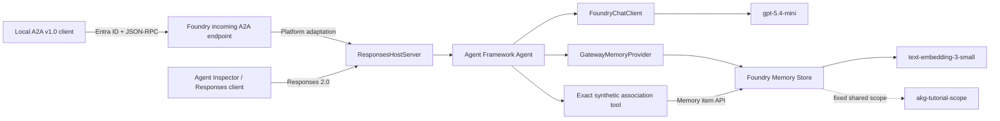

# Build Your First Agentic Knowledge Gateway

This beginner tutorial builds a small but complete **Agentic Knowledge
Gateway** with Foundry Toolkit, GitHub Copilot, Microsoft Agent Framework,
Foundry Memory, a Foundry Hosted Agent, Responses 2.0, and incoming A2A v1.0.

You start from Microsoft's official Foundry Memory sample, make bounded changes
with GitHub Copilot, verify memory through the service API, deploy the Gateway,
and call it from a local A2A client.

> [!NOTE]
> This workflow was validated on **August 15, 2026**. Foundry Memory, Hosted
> Agents, incoming A2A, Agent Framework hosting packages, and several CLI
> surfaces used here are preview features. Preview behavior, role names, SDK
> types, and UI labels can change.

> [!CAUTION]
> This project is a one-developer tutorial, not a production identity or
> knowledge platform. Every authorized caller uses the fixed
> `akg-tutorial-scope`. That scope is shared state, not an authorization
> boundary and not per-user isolation. Use only synthetic, non-sensitive data.

## What You Will Learn

By the end of the tutorial, you will be able to:

- scaffold the official Python / Agent Framework / Responses / Foundry Memory
  sample with Foundry Toolkit;
- preserve the untouched Microsoft sample as a Git baseline;
- use GitHub Copilot with explicit architecture and security boundaries;
- provision a Foundry Project, chat model, embedding model, and Memory Store;
- connect `FoundryChatClient` and a proof-aware `FoundryMemoryProvider`;
- verify the current write through the Memory API with an independently random
  opaque key/value pair instead of trusting agent prose or stale shared data;
- debug the Responses endpoint locally in Agent Inspector;
- deploy source code to the Foundry-managed Python 3.13 runtime;
- assign the identities required for model, Memory, and Hosted Agent access;
- enable incoming A2A v1.0 without removing Responses 2.0;
- discover the authenticated v1.0 Agent Card;
- run a local non-streaming A2A JSON-RPC client; and
- prepare a small P0 evaluation dataset without making evaluation part of the
  beginner's core path.

## What This Gateway Is—and Is Not

The tutorial uses Foundry Memory as a deliberately narrow first knowledge
backend.

| It demonstrates | It does not demonstrate |
|---|---|
| Semantic storage of synthetic preferences, project facts, and proof values | A general document database or source-of-truth system |
| Unambiguous key-only recall across separate Responses and A2A tasks | Per-user authorization or tenant isolation |
| A shared seven-day tutorial scope | Production retention, privacy, or compliance controls |
| Incoming A2A access to one Hosted Gateway | A second Hosted caller agent or OBO propagation |
| Direct Foundry Memory integration | MCP, Foundry IQ, Azure AI Search, SQL, Cosmos DB, or graph databases |

The larger architecture can later grow into this:

```text
Chat Agent A ─┐
Chat Agent B ─┼─ A2A ─> Agentic Knowledge Gateway
Business C ───┘                 │
                                ├─ MCP ─> Personal Memory Store
                                ├─ MCP ─> Organization Knowledge Base
                                ├─ MCP ─> Azure AI Search
                                └─ MCP ─> SQL / Cosmos DB / Graph DB
```

This tutorial implements only the first vertical slice: one Gateway, one local
A2A test client, and one Foundry Memory Store.

## Runtime Architecture



The boundaries are important:

| Component | Responsibility |
|---|---|
| **Foundry Toolkit** | Scaffolds the official sample, selects resources, opens Agent Inspector, and starts deployment workflows. |
| **GitHub Copilot** | Makes bounded, reviewable changes after the Microsoft scaffold is committed. |
| **Agent Framework** | Composes the agent, model client, context provider, and response behavior. |
| **ResponsesHostServer** | Exposes the Hosted Agent's Responses 2.0 application contract on port `8088`. |
| **GatewayMemoryProvider** | Uses `FoundryMemoryProvider` for semantic retrieval and ordinary updates while excluding strict proof writes from lossy after-run extraction. |
| **Exact synthetic association tool** | Validates opaque tutorial key/value input and writes one authoritative Memory item for deterministic proof. |
| **Foundry Memory Store** | Extracts, embeds, stores, expires, and searches semantic memory items. |
| **Foundry incoming A2A** | Adapts authenticated A2A requests to the Hosted Agent endpoint after deployment. |
| **Local A2A client** | Verifies authenticated Agent Card discovery and non-streaming A2A JSON-RPC interoperability. |

Local F5 debugging validates the Responses path. Incoming A2A is a Foundry
platform capability and is tested only after cloud deployment.

## Tested Toolchain

These versions describe the validated environment, not permanent minimums.

| Tool or package | Tested value |
|---|---|
| Windows / WSL | Windows 11 / Ubuntu 24.04 |
| Editor | Visual Studio Code - Insiders |
| Foundry Toolkit | 1.6.8 |
| Foundry Toolkit catalog commit | `a2435554c7ba41fb76fdc37623c2f3715ca81c86` |
| Official source sample | `samples/python/hosted-agents/agent-framework/responses/13-foundry-memory` |
| Azure Developer CLI | 1.30.0 |
| `microsoft.foundry` azd extension | 1.0.0-beta.2 |
| `azure.ai.agents` azd extension | 1.0.0-beta.9 |
| Local Python | 3.12.3 |
| Hosted Code runtime | Python 3.13 |
| `agent-framework-foundry` | 1.11.0 |
| `agent-framework-foundry-hosting` | 1.0.0b260813 |
| `azure-ai-projects` | 2.3.0 |
| `a2a-sdk` | 1.0.2 |
| Hosted application protocol | Responses 2.0.0 |
| Incoming agent protocol | A2A 1.0 JSON-RPC, non-streaming |
| Region used for validation | East US 2 |
| Chat deployment | `gpt-5.4-mini` |
| Embedding deployment | `text-embedding-3-small` |

## Prerequisites

Install:

- [Visual Studio Code - Insiders](https://code.visualstudio.com/insiders/);
- [Foundry Toolkit](https://marketplace.visualstudio.com/items?itemName=ms-windows-ai-studio.windows-ai-studio);
- [GitHub Copilot](https://marketplace.visualstudio.com/items?itemName=GitHub.copilot);
- [Python](https://marketplace.visualstudio.com/items?itemName=ms-python.python);
- Python 3.12;
- [`uv`](https://docs.astral.sh/uv/);
- [Azure CLI](https://learn.microsoft.com/cli/azure/install-azure-cli);
- [Azure Developer CLI](https://learn.microsoft.com/azure/developer/azure-developer-cli/install-azd);
- Git; and
- an Azure subscription that permits Foundry Projects, model deployments,
  Hosted Agents, role assignments, and preview Memory features.

Install the Foundry CLI extension bundle and authenticate from WSL:

```bash
azd ext install microsoft.foundry
az login
azd auth login
```

Verify:

```bash
python3.12 --version
uv --version
az account show
azd version
azd ai agent version
```

Model and preview availability varies by region and subscription. Confirm
capacity before copying the tutorial's model choices.

## RBAC You Will Need

The role names **Foundry User**, **Foundry Owner**, **Foundry Account Owner**,
and **Foundry Project Manager** were previously named Azure AI roles. Both old
and new names can still appear while the rename rolls out.

The validated topology used these assignments:

| Identity | Scope | Role | Purpose |
|---|---|---|---|
| Developer | Foundry Project or inherited | Foundry User | Project, Agent, and Memory data-plane access |
| Developer | Foundry account | Cognitive Services OpenAI User | Direct chat and embedding model calls |
| Foundry Project system identity | Foundry Project | Foundry User | Project data-plane access used by managed services |
| Foundry Project system identity | Foundry account | Cognitive Services OpenAI User | Memory-backed embedding/model access |
| Foundry account system identity | Foundry Project | Foundry User | Managed Foundry service access in the validated topology |
| Foundry account system identity | Foundry account | Cognitive Services OpenAI User | Managed model invocation in the validated topology |
| Hosted Agent instance identity | Foundry Project | Foundry User | Runtime Project and Memory access |
| Hosted Agent instance identity | Foundry account | Cognitive Services OpenAI User | Runtime model access |
| Hosted Agent instance identity | Foundry account | Cognitive Services User | Hosted Agent invocation requirement |

Role assignment can take several minutes to propagate. A Memory Store can be
created successfully even while its first embedding-backed write still fails
with a nested `401`. The direct health and persistence checks later in the
tutorial catch that case.

## 1. Scaffold the Official Foundry Memory Sample

If you cloned this completed repository, the scaffold already exists. Open
`agentic-knowledge-gateway` as the workspace root and continue to
[Create the Python environment](#4-create-the-python-environment).

To reproduce the project from scratch in Foundry Toolkit:

1. Open the Foundry Toolkit view.
2. Select **Developer Tools** → **Build** → **Create Agent**.
3. Under **Create in code with full control**, select **Use a sample**.
4. Choose the sample tagged:
   - **Python**
   - **Agent Framework**
   - **Responses**
   - **Foundry Memory**
5. Choose the repository as **Workspace Folder**.
6. Use `agentic-knowledge-gateway` as **Folder Name**.
7. Select **Skip for now** for environment setup.
8. Open the generated directory as the workspace root.

The catalog-pinned sample used here came from:

```text
samples/python/hosted-agents/agent-framework/responses/13-foundry-memory
```

### Preserve the untouched baseline

Before asking Copilot to customize anything:

```bash
git add agentic-knowledge-gateway
git commit -m "Scaffold Foundry memory agent"
```

The baseline in this repository is commit `910302d`. It provides an auditable
boundary between Microsoft-generated code and the tutorial changes:

```bash
git show --stat 910302d
git diff 910302d -- agentic-knowledge-gateway
```

## 2. Extend the Sample with GitHub Copilot

Use Copilot Agent mode, but give it a narrow change contract. Review each
milestone separately rather than requesting the entire Gateway in one prompt.

### Prompt 1: establish guardrails

```text
This workspace is the official Microsoft Foundry Agent Framework Responses
sample with Foundry Memory.

Before editing, inspect azure.yaml, main.py, requirements.txt, and AGENTS.md.
Then add project instructions with these invariants:

- preserve ResponsesHostServer and Responses 2.0;
- use DefaultAzureCredential and never add keys or secrets;
- call load_dotenv(override=False);
- keep main.py as a thin entry point;
- make FOUNDRY_PROJECT_ENDPOINT, AZURE_AI_MODEL_DEPLOYMENT_NAME,
  MEMORY_STORE_NAME, and MEMORY_SCOPE required;
- MEMORY_SCOPE is one fixed shared tutorial scope, not per-user isolation;
- store only synthetic, non-sensitive tutorial facts;
- keep Memory and A2A described as preview features;
- fail clearly when required Memory access is unavailable;
- add focused unittest coverage;
- do not deploy or delete cloud resources.

Show the proposed files before editing.
```

### Prompt 2: refactor into testable modules

```text
Refactor the generated sample without changing its Hosted Agent contract.

- move typed environment validation into gateway/settings.py;
- move the seven-day Memory Store definition and drift detection into
  gateway/memory_config.py;
- compose FoundryChatClient, FoundryMemoryProvider, Agent, and
  ResponsesHostServer in gateway/app.py;
- reuse client.project_client for the Memory provider;
- add a strict Agent tool that accepts only tutorial-generated opaque key/value
  input and writes one exact user-profile Memory item;
- wrap `FoundryMemoryProvider` so a turn containing that strict pair bypasses
  semantic after-run updates that could later rewrite the authoritative item;
- set allow_preview=True, update_delay=0, and store=False;
- perform a real embedding-backed Memory search before server startup;
- keep main.py responsible only for dotenv loading, settings, and asyncio.run;
- reject empty values and unresolved ${VAR} or {{VAR}} placeholders;
- add unittest tests for settings and the Memory definition.

Do not catch broad exceptions and silently disable Memory.
```

### Prompt 3: add deployment and A2A tooling

```text
Add explicit developer scripts outside the Hosted runtime dependency set.

- provision_memory_store.py: idempotent create, read-back, seven-day TTL,
  drift detection, and embedding-backed access check;
- memory_proof.py: create independent opaque key/value values for each proof;
- memory_polling.py: retry only bounded transient service failures;
- verify_memory.py: require one item containing the exact current pair and
  support a pre-write absence check;
- cleanup_memory.py: delete a scope or store only after explicit confirmation;
- configure_a2a.py: preserve Responses and add incoming A2A using
  protocol_configuration, Agent Card version 1.0, and v1.0 card verification;
- a2a_client.py: authenticate with DefaultAzureCredential, fetch
  agentCard/v1.0, require a JSONRPC v1.0 supportedInterface, send a
  non-streaming request, verify Memory directly, then perform fresh-task recall;
- sync_agent_metadata.py: generate ignored environment metadata from resolved
  azd JSON without committing an account endpoint;
- put a2a-sdk and test-only packages in requirements-dev.txt;
- add VS Code tasks and focused unit tests.

Do not use the legacy protocols array or assume protocolVersion is a top-level
field in the served A2A v1.0 Agent Card.
```

### Copilot review checklist

Reject a diff that:

- adds an API key, access token, secret, or real `.env`;
- replaces `DefaultAzureCredential`;
- describes the fixed scope as per-user isolation;
- makes Memory optional after startup;
- removes Responses while adding A2A;
- uses an A2A v0.3-only Agent Card check;
- trusts model prose as proof of persistence;
- relies on semantic extraction to preserve an opaque proof pair verbatim;
- includes the expected opaque value in a recall query;
- commits generated environment-specific agent metadata;
- automatically deletes or recreates an incompatible Memory Store; or
- puts A2A development dependencies in the Hosted runtime requirements.

Path-specific Copilot instructions are in
[`../.github/instructions/agentic-knowledge-gateway.instructions.md`](../.github/instructions/agentic-knowledge-gateway.instructions.md).

## 3. Understand the Customized Project

```text
agentic-knowledge-gateway/
├── .vscode/
│   ├── launch.json
│   ├── settings.json
│   └── tasks.json
├── AGENTS.md
├── README.md
├── azure.yaml
└── src/
    └── agent-framework-agent-foundry-memory-responses/
        ├── .foundry/
        │   ├── agent-metadata.example.yaml
        │   ├── eval.yaml
        │   ├── datasets/
        │   ├── evaluators/
        │   └── results/
        ├── gateway/
        │   ├── a2a_config.py
        │   ├── app.py
        │   ├── memory_config.py
        │   ├── memory_proof.py
        │   ├── memory_provider.py
        │   ├── memory_tools.py
        │   └── settings.py
        ├── scripts/
        │   ├── a2a_client.py
        │   ├── cleanup_memory.py
        │   ├── configure_a2a.py
        │   ├── memory_polling.py
        │   ├── memory_proof.py
        │   ├── provision_memory_store.py
        │   ├── sync_agent_metadata.py
        │   └── verify_memory.py
        ├── tests/
        ├── .env.example
        ├── main.py
        ├── requirements.txt
        └── requirements-dev.txt
```

| File | Purpose |
|---|---|
| `azure.yaml` | Declares Project/model provisioning and Code/Remote Hosted Agent deployment. |
| `gateway/settings.py` | Validates required environment values and rejects unresolved placeholders. |
| `gateway/memory_config.py` | Defines the seven-day store, safe data instructions, typed search inputs, and drift comparison. |
| `gateway/memory_proof.py` | Defines the runtime-safe opaque proof contract shared by the Agent tool and developer scripts. |
| `gateway/memory_provider.py` | Preserves normal semantic updates but skips them for strict pair-write turns so they cannot rewrite the direct item. |
| `gateway/memory_tools.py` | Validates and writes exact synthetic associations through the Memory item API. |
| `gateway/app.py` | Performs the Memory health check and composes the Agent Framework runtime, provider, and write-through tool. |
| `gateway/a2a_config.py` | Builds Responses + A2A endpoint configuration, Agent Card metadata, URLs, and v1 interface checks. |
| `scripts/provision_memory_store.py` | Creates or verifies the store without destructive replacement. |
| `scripts/memory_proof.py` | Creates an independently random opaque key/value pair for one proof run. |
| `scripts/memory_polling.py` | Applies bounded retries only to known transient Memory service failures. |
| `scripts/verify_memory.py` | Proves one Memory item contains the exact pair and supports a negative pre-write check. |
| `scripts/configure_a2a.py` | Enables incoming A2A after deployment and verifies the served card. |
| `scripts/a2a_client.py` | Runs authenticated A2A remember, direct Memory verification, and recall. |
| `scripts/sync_agent_metadata.py` | Generates ignored local metadata from the selected `azd` environment. |
| `.foundry/` | Holds a metadata example and an optional P0 evaluation starter. |

The runtime dependencies intentionally exclude `a2a-sdk`, test code, scripts,
and `.foundry` assets. `.azdignore` keeps them out of the Hosted code package.

## 4. Create the Python Environment

From `agentic-knowledge-gateway`:

```bash
uv venv --python 3.12 .venv
uv pip install \
  --prerelease=allow \
  --python .venv/bin/python \
  -r src/agent-framework-agent-foundry-memory-responses/requirements-dev.txt
```

`--prerelease=allow` is required because the current Agent Framework Foundry
hosting adapter depends on preview Agent Server packages.

Run the focused checks:

```bash
cd src/agent-framework-agent-foundry-memory-responses
../../.venv/bin/python -m compileall -q gateway scripts tests main.py
../../.venv/bin/python -m unittest discover -s tests -v
cd ../..
```

In VS Code:

1. press `Ctrl+Shift+P`;
2. run **Python: Select Interpreter**; and
3. choose `agentic-knowledge-gateway/.venv/bin/python`.

## 5. Configure and Provision Microsoft Foundry

The manifest creates a new East US 2 Project and declares both model
deployments with literal resource names. The `microsoft.foundry` provider passes
deployment `name` entries directly to ARM, so `${...}` placeholders are not
valid in those entries. Change the region, deployment name, or model
family/version only after checking current support, capacity, and quota.

Create or select the `azd` environment:

```bash
azd env new dev
```

If it already exists:

```bash
azd env select dev
```

Set placeholders to your values:

```bash
azd env set AZURE_SUBSCRIPTION_ID "<subscription-id>"
azd env set AZURE_LOCATION "eastus2"
azd env set AZURE_AI_MODEL_DEPLOYMENT_NAME "gpt-5.4-mini"
azd env set AZURE_AI_EMBEDDING_MODEL_DEPLOYMENT_NAME "text-embedding-3-small"
azd env set MEMORY_STORE_NAME "agentic_knowledge_gateway_memory"
azd env set MEMORY_SCOPE "akg-tutorial-scope"
azd env set FOUNDRY_HOSTED_AGENT_NAME "agentic-knowledge-gateway"
```

`AZURE_AI_MODEL_DEPLOYMENT_NAME` and
`AZURE_AI_EMBEDDING_MODEL_DEPLOYMENT_NAME` tell local and Hosted runtimes which
deployed models to call. Their values must match the literal
`services.ai-project.deployments[].name` entries in `azure.yaml`. To change a
deployment name or its catalog model, update the manifest and the corresponding
`azd` value together as one reviewed change.

Provision the Project and model deployments:

```bash
azd provision --no-prompt
```

Confirm the resolved Project:

```bash
azd ai project show --output json
azd env get-values
```

Do not commit `.azure/`; it contains local environment state.

### Create the local `.env`

```bash
cd src/agent-framework-agent-foundry-memory-responses
cp .env.example .env
```

Fill the ignored file with values from `azd env get-values`:

```dotenv
FOUNDRY_PROJECT_ENDPOINT="https://<account>.services.ai.azure.com/api/projects/<project>"
AZURE_AI_MODEL_DEPLOYMENT_NAME="gpt-5.4-mini"
AZURE_AI_EMBEDDING_MODEL_DEPLOYMENT_NAME="text-embedding-3-small"
MEMORY_STORE_NAME="agentic_knowledge_gateway_memory"
MEMORY_SCOPE="akg-tutorial-scope"
FOUNDRY_HOSTED_AGENT_NAME="agentic-knowledge-gateway"
```

Keep the endpoint shape exact. Do not use the Azure portal URL or an account
endpoint without `/api/projects/<project>`.

## 6. Assign Project and Memory Model Access

The following WSL/Bash example uses placeholders. An administrator might need
to run it.

```bash
SUBSCRIPTION_ID="<subscription-id>"
RESOURCE_GROUP="<resource-group>"
ACCOUNT_NAME="<foundry-account-name>"
PROJECT_NAME="<foundry-project-name>"

ACCOUNT_SCOPE="/subscriptions/${SUBSCRIPTION_ID}/resourceGroups/${RESOURCE_GROUP}/providers/Microsoft.CognitiveServices/accounts/${ACCOUNT_NAME}"
PROJECT_SCOPE="${ACCOUNT_SCOPE}/projects/${PROJECT_NAME}"

USER_OBJECT_ID="$(az ad signed-in-user show --query id -o tsv)"
PROJECT_PRINCIPAL_ID="$(
  az rest \
    --method get \
    --url "https://management.azure.com${PROJECT_SCOPE}?api-version=2025-06-01" \
    --query identity.principalId \
    --output tsv
)"
ACCOUNT_PRINCIPAL_ID="$(
  az cognitiveservices account show \
    --resource-group "${RESOURCE_GROUP}" \
    --name "${ACCOUNT_NAME}" \
    --query identity.principalId \
    --output tsv
)"
```

Grant the developer model access if it is not inherited:

```bash
az role assignment create \
  --assignee-object-id "${USER_OBJECT_ID}" \
  --assignee-principal-type User \
  --role "Cognitive Services OpenAI User" \
  --scope "${ACCOUNT_SCOPE}"
```

Grant the validated managed-service identities:

```bash
for PRINCIPAL_ID in "${PROJECT_PRINCIPAL_ID}" "${ACCOUNT_PRINCIPAL_ID}"; do
  az role assignment create \
    --assignee-object-id "${PRINCIPAL_ID}" \
    --assignee-principal-type ServicePrincipal \
    --role "Foundry User" \
    --scope "${PROJECT_SCOPE}"

  az role assignment create \
    --assignee-object-id "${PRINCIPAL_ID}" \
    --assignee-principal-type ServicePrincipal \
    --role "Cognitive Services OpenAI User" \
    --scope "${ACCOUNT_SCOPE}"
done
```

Your developer identity also needs **Foundry User** at the Project or an
inherited parent scope.

Wait for RBAC propagation before interpreting a nested Memory model `401` as a
code defect.

## 7. Provision and Verify the Memory Store

From the service source directory:

```bash
../../.venv/bin/python -m scripts.provision_memory_store
```

Expected first-run shape:

```text
Creating Memory Store 'agentic_knowledge_gateway_memory'...
Verified Memory Store 'agentic_knowledge_gateway_memory' and scope 'akg-tutorial-scope'.
```

The store definition enables:

- user-profile memory;
- `604800` seconds, or seven days, as the default TTL.

It disables:

- chat summaries; and
- procedural memory.

The store instructions reject credentials, secrets, financial data, health
data, legal data, precise locations, and other sensitive information.

The Gateway uses two complementary Memory paths:

- `GatewayMemoryProvider` delegates semantic retrieval and automatic interaction
  updates for ordinary synthetic preferences and project facts to
  `FoundryMemoryProvider`; and
- `remember_synthetic_association` handles only the strict `akg...=akv...`
  tutorial proof shape and writes it through the Memory item API.

The second path is necessary because semantic extraction can legitimately
summarize or generalize conversation text. A byte-like opaque value must not
depend on that lossy behavior when it is used as verification evidence. For a
turn containing a strict pair, the provider skips its semantic after-run update
so that asynchronous extraction cannot rewrite the direct authoritative item.

The script is safe to rerun:

- a matching store is read and verified;
- a missing store is created;
- incompatible model, option, or TTL drift stops the script; and
- the script never deletes and recreates data automatically.

The final health check sends a correctly typed Responses message to Memory
search. This forces an embedding-backed operation and catches the case where
store creation succeeds but managed model access is still unauthorized.

## 8. Run and Verify Locally Through Responses

### F5 and Agent Inspector

1. Open `agentic-knowledge-gateway` as the VS Code workspace root.
2. Select `.venv/bin/python`.
3. Press `F5`.
4. Select **Debug Agentic Knowledge Gateway** if prompted.
5. Wait for Agent Inspector to open.
6. Confirm port `8088` and the Responses protocol.

The task starts `main.py` under `debugpy`, waits for the host, and opens Agent
Inspector. Incoming A2A is not available locally.

### Manual alternative

```bash
cd src/agent-framework-agent-foundry-memory-responses
../../.venv/bin/python main.py
```

Readiness is exposed at:

```bash
curl http://localhost:8088/readiness
```

### Create an opaque proof and verify it is absent

In another terminal, start from `agentic-knowledge-gateway`. Generate a random
key and an independently random value:

```bash
cd src/agent-framework-agent-foundry-memory-responses
read KEY VALUE < <(
  ../../.venv/bin/python -c \
    'from scripts.memory_proof import create_proof; p = create_proof(); print(p.key, p.value)'
)
printf 'Verification key: %s\nExpected value: %s\n' "$KEY" "$VALUE"

../../.venv/bin/python -m scripts.verify_memory \
  --key "$KEY" \
  --value "$VALUE" \
  --expect-absent \
  --timeout 60
```

Keep using this terminal so `KEY` and `VALUE` remain available. The absence
check is a negative control for this exact pair.

### Store and verify the exact pair

```bash
cd ../..
azd ai agent invoke \
  --local \
  --new-session \
  --new-conversation \
  "Remember this exact synthetic tutorial key/value association as one fact: ${KEY}=${VALUE}. Preserve the complete pair exactly."

cd src/agent-framework-agent-foundry-memory-responses
../../.venv/bin/python -m scripts.verify_memory \
  --key "$KEY" \
  --value "$VALUE" \
  --timeout 300
```

Agent acknowledgement is not proof of persistence. The direct verifier requires
the exact `key=value` pair in one item returned by the authoritative Memory item
list API. It never combines unrelated items or depends on semantic search
ranking. The Agent's strict write-through tool validates the synthetic formats
before creating that item. Known transient transport, RBAC-propagation,
throttling, and service errors retry only within the supplied timeout; a final
failure remains visible with its cause.

### Recall in independent Responses state

```bash
cd ../..
azd ai agent invoke \
  --local \
  --new-session \
  --new-conversation \
  "What exact synthetic tutorial value is associated with key ${KEY}? Return the value exactly."
```

Expected meaning:

```text
akvfedcba9876543210
```

The query contains only the key. Because the value was generated independently
and is absent from the query, returning it after both resets is evidence of
Memory-backed retrieval rather than inference or ordinary conversation history.

Stop the debugger with `Shift+F5` before deployment.

## 9. Deploy the Hosted Gateway

From `agentic-knowledge-gateway`:

```bash
azd deploy --no-prompt
```

The manifest uses:

- Code deployment;
- Remote dependency resolution;
- Foundry-managed Python 3.13;
- `python main.py`;
- Responses 2.0.0;
- `0.5` CPU and `1Gi` memory; and
- the same model, store name, and fixed scope used locally.

The optional Dockerfile also uses Python 3.13 so it matches the Hosted runtime.
The workspace virtual environment remains on Python 3.12 for local development.

Wait for the version to become active:

```bash
azd ai agent show agentic-knowledge-gateway --output json
```

Confirm:

- `status` is `active`;
- the intended version is selected;
- `protocol_versions` contains Responses `2.0.0`; and
- `instance_identity.principal_id` is present.

Generate ignored local metadata for this exact deployment:

```bash
cd src/agent-framework-agent-foundry-memory-responses
../../.venv/bin/python -m scripts.sync_agent_metadata --environment dev
../../.venv/bin/python -m scripts.sync_agent_metadata \
  --environment dev \
  --check
cd ../..
```

Review the values and type `WRITE` at the first command. The tracked
`agent-metadata.example.yaml` remains environment-neutral.

### Grant the Hosted Agent instance identity

Using `ACCOUNT_SCOPE` and `PROJECT_SCOPE` from the RBAC section:

```bash
INSTANCE_PRINCIPAL_ID="$(
  azd ai agent show agentic-knowledge-gateway --output json |
    jq -r .instance_identity.principal_id
)"

az role assignment create \
  --assignee-object-id "${INSTANCE_PRINCIPAL_ID}" \
  --assignee-principal-type ServicePrincipal \
  --role "Foundry User" \
  --scope "${PROJECT_SCOPE}"

az role assignment create \
  --assignee-object-id "${INSTANCE_PRINCIPAL_ID}" \
  --assignee-principal-type ServicePrincipal \
  --role "Cognitive Services OpenAI User" \
  --scope "${ACCOUNT_SCOPE}"

az role assignment create \
  --assignee-object-id "${INSTANCE_PRINCIPAL_ID}" \
  --assignee-principal-type ServicePrincipal \
  --role "Cognitive Services User" \
  --scope "${ACCOUNT_SCOPE}"
```

The **instance identity** is the runtime principal. Do not substitute the
blueprint identity.

## 10. Verify Hosted Responses and Memory

First, verify a simple hosted response:

```bash
azd ai agent invoke \
  --new-session \
  --new-conversation \
  "Reply with exactly: Gateway online"
```

Then reset only the shared tutorial scope:

```bash
cd src/agent-framework-agent-foundry-memory-responses
../../.venv/bin/python -m scripts.cleanup_memory --scope
```

Type `DELETE` when prompted. Generate a fresh opaque key/value pair and prove it
is absent:

```bash
read KEY VALUE < <(
  ../../.venv/bin/python -c \
    'from scripts.memory_proof import create_proof; p = create_proof(); print(p.key, p.value)'
)
printf 'Verification key: %s\nExpected value: %s\n' "$KEY" "$VALUE"

../../.venv/bin/python -m scripts.verify_memory \
  --key "$KEY" \
  --value "$VALUE" \
  --expect-absent \
  --timeout 60
```

Return to the project root and store the pair:

```bash
cd ../..
azd ai agent invoke \
  --new-session \
  --new-conversation \
  "Remember this exact synthetic tutorial key/value association as one fact: ${KEY}=${VALUE}. Preserve the complete pair exactly."
```

Verify the service state:

```bash
cd src/agent-framework-agent-foundry-memory-responses
../../.venv/bin/python -m scripts.verify_memory \
  --key "$KEY" \
  --value "$VALUE" \
  --timeout 300
```

Finally, discard both the saved Hosted session and conversation:

```bash
cd ../..
azd ai agent invoke \
  --new-session \
  --new-conversation \
  "What exact synthetic tutorial value is associated with key ${KEY}? Return the value exactly."
```

Using both flags matters. `--new-session` resets sticky compute state;
`--new-conversation` discards Responses history. Recall after both resets is
evidence of Memory-backed context because the independent value is not present
in the query.

## 11. Enable and Verify Incoming A2A v1.0

`azd deploy` establishes the Responses endpoint. A2A configuration is a
separate, explicit post-deployment action:

```bash
cd src/agent-framework-agent-foundry-memory-responses
../../.venv/bin/python -m scripts.configure_a2a
```

The script:

1. reads the Hosted Agent;
2. preserves Responses;
3. adds `A2AProtocolConfiguration`;
4. sets an Agent Card version of `1.0`;
5. requests an Entra token for `https://ai.azure.com/.default`;
6. fetches the authenticated `agentCard/v1.0` path; and
7. requires a `supportedInterfaces` entry with:
   - `protocolBinding: JSONRPC`; and
   - `protocolVersion: "1.0"`.

Inspect the endpoint:

```bash
cd ../..
azd ai agent endpoint show agentic-knowledge-gateway --output json
```

You should see both `responses` and `a2a`.

> [!IMPORTANT]
> In the served A2A v1.0 card, `protocolVersion` is not a top-level field. It is
> inside `supportedInterfaces`. The live Foundry card can also advertise v0.3
> compatibility interfaces; this client explicitly selects and requires v1.0
> JSON-RPC.

### Run the local A2A client

```bash
cd src/agent-framework-agent-foundry-memory-responses
../../.venv/bin/python -m scripts.cleanup_memory --scope
../../.venv/bin/python -m scripts.a2a_client
cd ../..
```

The client:

1. authenticates with `DefaultAzureCredential`;
2. retrieves `agentCard/v1.0`;
3. verifies a v1.0 JSON-RPC interface;
4. creates an opaque key and an independently random value;
5. confirms the exact pair is absent from the Memory item list;
6. sends the exact pair through A2A so the Gateway invokes its strict
   write-through tool;
7. requires one authoritative Foundry Memory item containing that pair;
8. creates a new A2A message/task without prior task context;
9. asks for the value using only the key; and
10. requires the independent value in the returned text.

Expected output shape:

```text
Verification key: akg0123456789abcdef
Expected value: akvfedcba9876543210
Verified the generated key/value pair is absent.
Remembered: akg0123456789abcdef=akvfedcba9876543210
Verified this run's exact pair in one Foundry Memory item.
akvfedcba9876543210
```

The test proves authenticated A2A interoperability for one developer identity.
It does not prove OBO propagation or two-user Memory isolation.

> [!NOTE]
> With the tested `azd` 1.30.0 / agents extension, `azd ai agent invoke
> --protocol a2a` can construct a legacy v0.3-shaped payload even when the v1.0
> card is available. The bundled `a2a-sdk` client is the authoritative v1.0
> tutorial path.

## 12. Optional P0 Evaluation Starter

The service source keeps environment-neutral Foundry workflow assets under
`.foundry/`:

- `agent-metadata.example.yaml` contains placeholders plus reusable protocols,
  Memory settings, and test cases;
- `datasets/agentic-knowledge-gateway-eval-seed-v1.jsonl` contains 20
  synthetic, stateless capability and safety prompts;
- `evaluators/builtin-baseline.yaml` records the intended built-in baseline;
- `eval.yaml` references relevance, task adherence, intent resolution, and
  indirect attack evaluators; and
- `results/` is reserved for local outputs.

Every dataset row contains both `query` and concrete `expected_behavior`.

If you skipped metadata generation in the deployment step, generate it before
using later Foundry workflows:

```bash
cd src/agent-framework-agent-foundry-memory-responses
../../.venv/bin/python -m scripts.sync_agent_metadata --environment dev
```

Review the displayed Project, Agent version, region, store, and scope, then type
`WRITE`. The generated `.foundry/agent-metadata.yaml` is ignored by Git. Confirm
that it still matches the selected `azd` environment:

```bash
../../.venv/bin/python -m scripts.sync_agent_metadata \
  --environment dev \
  --check
```

Evaluation execution is intentionally outside the core tutorial. When you are
ready, and only after metadata sync:

```bash
azd ai agent eval run
```

Review the dataset, evaluator availability, model costs, and thresholds before
running it. Stateful multi-turn Memory evaluation and trace-derived regression
datasets are advanced follow-ups.

## Troubleshooting

| Symptom | Likely cause | Resolution |
|---|---|---|
| `uv` refuses to resolve dependencies | Preview Agent Server packages are required | Install with `uv pip install --prerelease=allow ...`. |
| Settings report an unresolved `${VAR}` or `{{VAR}}` | A deployment placeholder was copied literally | Set the real value in `.env` or `azd env`; do not suppress validation. |
| Memory Store creation succeeds but writes fail with nested embedding `401` | Managed Foundry identity lacks model access or RBAC has not propagated | Assign Foundry User and Cognitive Services OpenAI User to the Project/account identities at the documented scopes; wait and rerun the embedding-backed check. |
| The agent responds but Memory stays empty | `FoundryMemoryProvider` treats semantic update failures as non-critical, or the exact-association tool failed | Inspect Hosted logs and run `scripts.verify_memory --key "$KEY" --value "$VALUE"`; never treat acknowledgement prose as persistence proof. |
| `verify_memory` times out | The exact current pair was not stored, or transient RBAC/service failures did not recover within the budget | Confirm the same key and value are used. The full `key=value` pair must occur in one item; the final timeout retains the last transient error as its cause. |
| Fresh recall returns a plausible answer but not the expected value | The response came from inference or unrelated state rather than this proof | Require the independently generated `akv...` value. Do not include that value in the recall query. |
| `azd ai agent eval run` targets the wrong Project or version | Local metadata is missing or stale | Run `scripts.sync_agent_metadata --environment dev`, then rerun it with `--check`. Generated metadata is intentionally ignored. |
| Local server returns 404 for `/health` | The Agent Server readiness route is different | Use `/readiness`. |
| F5 uses `/usr/bin/python3` | VS Code selected the system interpreter | Select `agentic-knowledge-gateway/.venv/bin/python`. |
| Hosted invocation returns 403 | Instance identity lacks minimum runtime access | Assign Cognitive Services User at account scope and the Project/model roles shown above. |
| Hosted version is active but startup repeatedly fails | Memory health check or runtime environment is invalid | Run `azd ai agent monitor`, inspect the exact session, and verify model, store, scope, and RBAC. |
| A2A card returns 200 but top-level `protocolVersion` is absent | v1.0 advertises protocols under `supportedInterfaces` | Require a JSONRPC interface whose `protocolVersion` is `1.0`. |
| A2A request returns a transient internal error | Incoming A2A and Hosted routing are preview services | Confirm the version is active, inspect session logs, retry once, and avoid hiding repeatable failures. |
| `azd ai agent invoke --protocol a2a` reports a missing `kind` | Tested CLI emitted a legacy payload shape | Use `scripts.a2a_client`, which uses `a2a-sdk` 1.0.2 and the authenticated v1.0 card. |
| `DefaultAzureCredential` logs a local IMDS timeout before succeeding | The local credential chain probed managed identity before Azure CLI | This is expected locally if the chain later reports `AzureCliCredential` success. |

Useful diagnostics:

```bash
azd ai agent doctor
azd ai agent show agentic-knowledge-gateway --output json
azd ai agent sessions list --output json
azd ai agent monitor --session-id "<session-id>" --tail 300 --utc
azd ai agent endpoint show agentic-knowledge-gateway --output json
```

## Security and Identity Limitations

- `MEMORY_SCOPE=akg-tutorial-scope` is fixed shared state.
- Scope names organize Memory; they are not authorization policies.
- Any authorized caller using this deployment can affect the shared scope.
- The A2A client proves caller-token authentication only.
- The tutorial does not validate OBO token propagation.
- The tutorial does not validate two-user isolation.
- The tutorial does not accept production PII, credentials, secrets,
  confidential records, health data, legal data, or financial data.
- `load_dotenv(override=False)` ensures Hosted runtime values take precedence.
- `.env`, `.azure/`, `.venv/`, tokens, and credentials must remain untracked.
- Memory and incoming A2A are preview features without production SLA claims.

A production design needs a trusted identity-to-scope mapping, explicit
authorization, tenant boundaries, deletion and audit controls, data
classification, encryption and network policies, and tests with at least two
identities.

## Cleanup and Cost Control

Delete only the shared tutorial scope:

```bash
cd src/agent-framework-agent-foundry-memory-responses
../../.venv/bin/python -m scripts.cleanup_memory --scope
```

Delete the entire tutorial Memory Store:

```bash
../../.venv/bin/python -m scripts.cleanup_memory --store
```

Both commands require typing `DELETE` unless `--yes` is supplied explicitly.

Delete the Hosted Agent through Foundry Toolkit or:

```bash
cd ../..
azd ai agent delete agentic-knowledge-gateway
```

Review model deployments, the Foundry Project, and the resource group
separately. Do not delete a shared Project, model, account, or resource group.

## Next Steps Toward the Full Gateway

1. Replace the fixed scope with a trusted caller identity-to-scope policy.
2. Validate OBO propagation and two-user isolation.
3. Add explicit remember, recall, list, and forget operations.
4. Put a knowledge-adapter boundary behind the Gateway.
5. Add remote MCP servers and Foundry Toolbox.
6. Connect Foundry IQ or an organization knowledge base.
7. Add Azure AI Search, SQL, Cosmos DB, or graph backends.
8. Add service-identity write policy, audit logs, and data governance.
9. Build stateful multi-turn evaluation and trace-derived regressions.
10. Add CI/CD and repeatable role-assignment automation.

## Official References

| Topic | Documentation |
|---|---|
| Hosted Agent with persistent Memory | [Quickstart: Give a hosted agent persistent memory](https://learn.microsoft.com/azure/foundry/agents/quickstarts/quickstart-memory-hosted-agent) |
| Create and use Memory | [Foundry Memory usage](https://learn.microsoft.com/azure/foundry/agents/how-to/memory-usage) |
| Hosted Agents | [Hosted Agent concepts](https://learn.microsoft.com/azure/foundry/agents/concepts/hosted-agents) |
| Hosted Agent deployment | [Deploy a Hosted Agent from code](https://learn.microsoft.com/azure/foundry/agents/how-to/deploy-hosted-agent-code) |
| Hosted Agent permissions | [Hosted Agent permissions](https://learn.microsoft.com/azure/foundry/agents/concepts/hosted-agent-permissions) |
| Foundry RBAC | [Role-based access control for Foundry](https://learn.microsoft.com/azure/foundry/concepts/rbac-foundry) |
| Agent Framework | [Microsoft Agent Framework](https://learn.microsoft.com/agent-framework/) |
| Foundry Toolkit | [Develop with Foundry Toolkit](https://learn.microsoft.com/azure/foundry/how-to/develop/get-started-projects-vs-code) |
| Foundry samples | [microsoft-foundry/foundry-samples](https://github.com/microsoft-foundry/foundry-samples) |
| A2A protocol | [A2A protocol specification](https://a2a-protocol.org/latest/specification/) |
