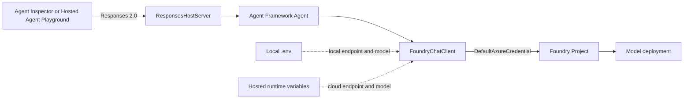

# Basic Microsoft Foundry Hosted Agent

This directory contains the runnable Agent Framework project created from the
Foundry Toolkit **Basic Hosted Agent** sample. It uses Python, Microsoft Agent
Framework, the Responses protocol, and Foundry source-code hosting.

For the complete beginner walkthrough—from installing Foundry Toolkit and
GitHub Copilot through cloud verification—start with the
[repository tutorial](../README.md).

> [!NOTE]
> The workflow was validated on August 14, 2026. The local environment uses
> Python 3.12; the Code/Remote Hosted Agent uses the Foundry-managed Python 3.13
> runtime declared in `azure.yaml`.

## Project Outcomes

This project demonstrates how to:

- build an Agent Framework `Agent` backed by `FoundryChatClient`;
- host it locally with `ResponsesHostServer`;
- authenticate without embedding API keys;
- customize the agent safely with GitHub Copilot Agent mode;
- test single-turn and multi-turn behavior in Agent Inspector;
- deploy a ZIP source package with Remote dependency resolution; and
- invoke the deployed code in Hosted Agent Playground.

## Runtime Architecture



`ResponsesHostServer` translates the Responses HTTP contract into Agent
Framework messages and translates the framework output back into response
events. The hosting layer manages conversation history, so the agent sets
`store=False` rather than creating a second history store.

## Directory Layout

```text
basic-hosted-agent/
├── .azure/                         # Ignored local azd environment state
├── .foundry/
│   ├── .deployment.json            # Ignored Foundry Toolkit workspace state
│   ├── agent-metadata.example.yaml # Tracked environment-neutral template
│   ├── agent-metadata.yaml         # Ignored Project and Agent mapping
│   ├── datasets/                   # Evaluation dataset cache
│   ├── evaluators/                 # Evaluation definition cache
│   └── results/                    # Local evaluation results
├── .venv/                          # Ignored local Python environment
├── .vscode/
│   ├── launch.json                 # Debugger attachment configuration
│   ├── settings.json               # Python environment manager preference
│   └── tasks.json                  # Server, Inspector, and cleanup tasks
├── src/
│   └── agent-framework-agent-basic-responses/
│       ├── .azdignore              # Excludes local files from Code packages
│       ├── .dockerignore           # Container build exclusions
│       ├── .env                    # Ignored local Foundry values
│       ├── .env.example            # Safe environment template
│       ├── Dockerfile              # Optional Container deployment
│       ├── main.py                 # Agent and hosting entry point
│       └── requirements.txt        # Runtime and debug dependencies
├── .gitignore
├── AGENTS.md                       # Coding-agent project instructions
├── CLAUDE.md                       # Compatibility instructions
└── azure.yaml                      # Unified Foundry/azd deployment manifest
```

## Source Walkthrough

The complete implementation is
[`src/agent-framework-agent-basic-responses/main.py`](src/agent-framework-agent-basic-responses/main.py).

### 1. Load local configuration safely

```python
load_dotenv(override=False)
```

`override=False` allows `.env` to supply local values but prevents it from
overwriting environment variables injected by the Hosted Agent runtime.

### 2. Resolve the model deployment

```python
model_name = os.getenv("AZURE_AI_MODEL_DEPLOYMENT_NAME") or os.getenv(
    "FOUNDRY_MODEL_NAME"
)
```

`AZURE_AI_MODEL_DEPLOYMENT_NAME` is the primary variable used by this project.
`FOUNDRY_MODEL_NAME` is a compatibility fallback. The code fails explicitly
when neither is configured.

### 3. Create the Foundry model client

```python
client = FoundryChatClient(
    project_endpoint=os.environ["FOUNDRY_PROJECT_ENDPOINT"],
    model=model_name,
    credential=DefaultAzureCredential(),
)
```

`DefaultAzureCredential` uses an available developer credential locally, such
as Azure CLI authentication, and participates in the managed-identity chain in
the Hosted Agent runtime. No model key is stored in source code.

### 4. Create the Agent Framework agent

```python
agent = Agent(
    client=client,
    instructions="あなたは日本語で簡潔かつ正確に回答し、不明なことを推測しないアシスタントです。",
    default_options={"store": False},
)
```

The Japanese instructions are an intentionally visible customization. Replace
them with the role, behavior, boundaries, and output format required by your
application.

### 5. Expose the Responses server

```python
server = ResponsesHostServer(agent)
server.run()
```

The server listens on port `8088` by default and is the entry point for both
local inspection and Hosted Agent deployment.

## Environment Variables

| Variable | Required | Source |
|---|---|---|
| `FOUNDRY_PROJECT_ENDPOINT` | Yes | Local `.env`, `azd` environment, or Hosted Agent project context |
| `AZURE_AI_MODEL_DEPLOYMENT_NAME` | Yes | Local `.env`, `azd` environment, or `azure.yaml` deployment variable |
| `FOUNDRY_MODEL_NAME` | No | Compatibility fallback |

Use these placeholder shapes:

```dotenv
FOUNDRY_PROJECT_ENDPOINT=https://<account>.services.ai.azure.com/api/projects/<project>
AZURE_AI_MODEL_DEPLOYMENT_NAME=<model-deployment-name>
```

The value of `AZURE_AI_MODEL_DEPLOYMENT_NAME` is the deployment name shown in
Foundry, not necessarily the catalog model-family name.

## Local Setup

Run these commands from this directory.

### 1. Authenticate

```bash
az login
azd auth login
```

### 2. Create the Python 3.12 environment

```bash
uv venv --python 3.12 .venv
uv pip install \
  --python .venv/bin/python \
  -r src/agent-framework-agent-basic-responses/requirements.txt
```

The requirements install:

- `agent-framework-foundry`;
- `agent-framework-foundry-hosting`; and
- `debugpy`.

Verify imports:

```bash
.venv/bin/python -c \
  "import agent_framework, agent_framework_foundry_hosting, azure.identity, dotenv; print('imports: ok')"
```

### 3. Create `.env`

```bash
cp \
  src/agent-framework-agent-basic-responses/.env.example \
  src/agent-framework-agent-basic-responses/.env
```

Edit the ignored `.env` with your Project endpoint and model deployment name.

### 4. Select the interpreter

In VS Code:

1. press `Ctrl+Shift+P`;
2. run **Python: Select Interpreter**; and
3. select `<workspace>/.venv/bin/python`.

The generated settings file does not hard-code an interpreter path. Confirm the
full path before pressing F5.

## Local Debugging with Agent Inspector

Press `F5` and use **Debug Local Agent HTTP Server**.

The generated tasks:

1. check ports `5679` and `8088`;
2. confirm that `debugpy` is installed in the selected interpreter;
3. run:

   ```text
   python -m debugpy --listen 127.0.0.1:5679 main.py --port 8088
   ```

4. wait for server startup; and
5. open Agent Inspector on port `8088`.

In Agent Inspector, confirm **Connected**, `http://localhost:8088`, and
**Responses Protocol**.

### Smoke test

First turn:

```text
Explain the difference between Microsoft Agent Framework and a Hosted Agent in
exactly two sentences, in Japanese.
```

Follow-up:

```text
Rewrite that explanation as a restaurant analogy in one sentence.
```

The follow-up should use the first response as context.

Stop the debugger with `Shift+F5`.

### Manual server alternative

```bash
cd src/agent-framework-agent-basic-responses
../../.venv/bin/python main.py
```

Then run **Foundry Toolkit: Open Agent Inspector** and connect to port `8088`.

## GitHub Copilot Customization

Use Agent mode with explicit boundaries. The following reusable prompt performs
the customization represented by this project:

```text
This workspace is a Microsoft Foundry Basic Hosted Agent built with Python,
Microsoft Agent Framework, and the Responses protocol.

Make only these changes:

1. In src/agent-framework-agent-basic-responses/main.py:
   - use load_dotenv(override=False);
   - type main as -> None;
   - make the agent answer briefly and accurately in Japanese and avoid
     guessing;
   - preserve ResponsesHostServer, DefaultAzureCredential, store=False,
     environment variable names, and port behavior.
2. Ensure the root .gitignore excludes .venv/, __pycache__/, *.py[cod], .env,
   .pytest_cache/, .ruff_cache/, and .azure/.
3. Ensure .env.example contains empty FOUNDRY_PROJECT_ENDPOINT and
   AZURE_AI_MODEL_DEPLOYMENT_NAME entries.
4. Do not change azure.yaml, Dockerfile, requirements.txt, Responses protocol,
   or port 8088.

Show a plan before editing, summarize the exact diff afterward, and verify
Python 3.12 syntax.
```

Always inspect the proposed diff. Reject changes that add secrets, weaken
authentication, alter the protocol, or edit unrelated files.

## Foundry and `azd` Configuration

Define environment-specific values locally:

```bash
export FOUNDRY_PROJECT_ENDPOINT="<foundry-project-endpoint>"
export AZURE_AI_MODEL_DEPLOYMENT_NAME="<model-deployment-name>"

azd ai project set "$FOUNDRY_PROJECT_ENDPOINT"
azd env new dev --no-prompt
azd env set \
  FOUNDRY_PROJECT_ENDPOINT \
  "$FOUNDRY_PROJECT_ENDPOINT" \
  -e dev
azd env set \
  AZURE_AI_MODEL_DEPLOYMENT_NAME \
  "$AZURE_AI_MODEL_DEPLOYMENT_NAME" \
  -e dev
```

Use `azd env select dev` instead of `azd env new` when the environment already
exists.

Inspect configuration:

```bash
azd env get-values -e dev
azd ai agent doctor --local-only -e dev --no-prompt
```

`.azure/` is local state and must remain ignored.

## `azure.yaml` Explained

The deployment manifest has two service concepts.

### Foundry Project reference

```yaml
ai-project:
  host: azure.ai.project
  endpoint: ${FOUNDRY_PROJECT_ENDPOINT}
```

When reusing an existing Project and model, reference the endpoint through the
`azd` environment and omit a `deployments:` block. This avoids declaring a
second model deployment, and it keeps an environment-specific endpoint out of
the tracked manifest.

Set the value once per environment:

```bash
azd env set FOUNDRY_PROJECT_ENDPOINT "https://<account>.services.ai.azure.com/api/projects/<project>"
azd env set AZURE_AI_PROJECT_ID "<foundry-project-resource-id>"
```

`azd deploy` also requires `AZURE_AI_PROJECT_ID` when the Project is not
provisioned by this manifest. Read both values from the Project that already
hosts your model deployment.

### Hosted Agent source package

```yaml
hosted-agent-service:
  host: azure.ai.agent
  project: src/agent-framework-agent-basic-responses
  language: python
  codeConfiguration:
    runtime: python_3_13
    entryPoint: main.py
    dependencyResolution: remote_build
  uses:
    - ai-project
  kind: hosted
  name: <hosted-agent-name>
  protocols:
    - protocol: responses
      version: 2.0.0
  environmentVariables:
    - name: AZURE_AI_MODEL_DEPLOYMENT_NAME
      value: ${AZURE_AI_MODEL_DEPLOYMENT_NAME}
  container:
    resources:
      cpu: "0.5"
      memory: 1.0Gi
```

| Field | Meaning |
|---|---|
| `project` | Directory packaged as the Agent source. |
| `runtime` | Managed Code-hosting runtime, independent of local Python. |
| `entryPoint` | Default startup file; the wizard displays `python main.py`. |
| `dependencyResolution` | `remote_build` installs `requirements.txt` in Azure. |
| `protocols` | Declares the Responses 2.0.0 contract exposed by the host. |
| `environmentVariables` | Passes the selected model deployment to the runtime. |
| `container.resources` | Requests the smallest tutorial compute allocation. |

## Deploy with Foundry Toolkit

The Toolkit path is the primary deployment workflow for this project.

1. Stop local debugging with `Shift+F5`.
2. Open Agent Inspector and select **Deploy**, or run
   **Foundry Toolkit: Deploy Hosted Agent**.
3. On **Basics**, select:
   - **Code**
   - **Remote**
   - **New agent**
   - `<hosted-agent-name>`
4. Select **Next**.
5. On **Review + Deploy**, confirm:
   - Python 3.13
   - `python main.py`
   - 0.5 CPU / 1.0 Gi
6. Select **Deploy**.
7. Wait for the new version to become active.

Deployment creates billable Azure resources.

### Verify the Hosted Agent

Hosted Agent Playground opens after a successful deployment. Repeat the local
two-turn smoke test. Confirm that:

- the selected Agent is `<hosted-agent-name>`;
- the version is active;
- protocol is Responses;
- the first response follows the Japanese instructions; and
- the follow-up retains context.

Use **Sessions**, **Traces**, **Evaluation**, and **Optimize** for later
operations.

## Optional `azd` Workflow

After the `dev` environment and `azure.yaml` are configured, `azd` can automate
the same lifecycle:

```bash
azd ai agent run -e dev
azd ai agent invoke --local "Hello" -e dev
azd deploy -e dev
azd ai agent invoke "Hello" -e dev
```

Do not mix assumptions about state: a deployment created only through the
Toolkit UI may not populate every `azd` deployment-tracking value. Use one
workflow consistently when automating updates.

## Code Deployment vs Container Deployment

| Decision | Code/Remote | Container |
|---|---|---|
| Package | Source ZIP | Linux AMD64 image |
| Dependencies | Installed remotely from project files | Installed during image build |
| Runtime | Foundry-managed Python 3.13 | Defined by Dockerfile, currently Python 3.12 |
| Registry | Not required | Azure Container Registry required |
| Best for | Pure Python and fastest onboarding | Native libraries or full runtime control |

Before using the Container path:

- exclude `.env` in `.dockerignore`;
- build for `linux/amd64`;
- use a unique image tag;
- grant the Hosted Agent identity repository-read permission; and
- never bake credentials into the image.

## Foundry Metadata

`.foundry/agent-metadata.yaml` makes later workflows reproducible:

```yaml
defaultEnvironment: dev
environments:
  dev:
    projectEndpoint: <foundry-project-endpoint>
    agentName: <hosted-agent-name>
    testCases: []
```

That file and `.foundry/.deployment.json` hold environment-specific endpoints
and identifiers, so both are ignored by Git. `agent-metadata.example.yaml` is
tracked as the environment-neutral template; copy it and fill in your own
values.

No `azureContainerRegistry` is needed for Code-package deployment. The cache
folders support future evaluation datasets, evaluator definitions, and result
comparisons.

## Security Notes

- `.env`, `.azure/`, and `.venv/` are ignored.
- `.azdignore` excludes `.env` from the source ZIP.
- `DefaultAzureCredential` avoids source-code keys.
- Entra ID and managed identity are preferred over local account keys.
- `load_dotenv(override=False)` protects Hosted Agent-injected values.
- Never put credentials into Copilot prompts.
- Review Azure role assignments using least privilege.

## Troubleshooting

| Problem | Resolution |
|---|---|
| F5 uses `/usr/bin/python3` | Run **Python: Select Interpreter** and choose `.venv/bin/python`. |
| `debugpy` is reported missing | Install requirements into `.venv`, then verify F5 uses that environment. |
| Agent Inspector is hidden by Terminal | Press `Ctrl+J` and select the **Playground** tab. |
| Port 5679 or 8088 is busy | Stop the previous debug task with `Shift+F5`. |
| Endpoint variable is missing | Create `.env` beside `main.py` and set `FOUNDRY_PROJECT_ENDPOINT`. |
| Model deployment is missing | Use the Foundry deployment name in `.env` and the `dev` azd environment. |
| Authentication fails locally | Run `az login` and `azd auth login`. |
| Project picker does not list a Project | Confirm the subscription, Toolkit sign-in, and Foundry RBAC. |
| `doctor` reports the Agent is not deployed | Expected before the first deployment; use `--local-only` for pre-deploy checks. |
| Deployment remains provisioning | Inspect Toolkit output and the Agent version logs; Remote dependency installation can take several minutes. |
| Toolkit cannot list account keys because local auth is disabled | Expected when Entra ID is required; it is not a deployment failure. |
| Hosted invocation returns 403 | Verify user and Hosted Agent identity roles on the Foundry resource. |
| `azd deploy` reports `AZURE_AI_PROJECT_ID is not set` | The manifest reuses an existing Project. Run `azd env set AZURE_AI_PROJECT_ID <project-resource-id>`. |
| `doctor` cannot resolve the Project endpoint | Run `azd env set FOUNDRY_PROJECT_ENDPOINT <endpoint>` for the selected environment. |

## Cleanup

Delete a tutorial Agent or version from Foundry Toolkit **Agents** only after
confirming that no other user depends on it. Delete the model deployment or
Foundry Project only when they were created exclusively for this tutorial.

Remove local generated state if needed:

```bash
rm -rf .venv .azure
```

Do not remove `.foundry/agent-metadata.yaml` if you intend to run evaluation,
trace, or redeployment workflows later.

## References

- [End-to-end repository tutorial](../README.md)
- [Microsoft Agent Framework](https://learn.microsoft.com/agent-framework/)
- [Host Agent Framework agents in Foundry](https://learn.microsoft.com/azure/foundry/how-to/develop/framework-hosted-agents)
- [Deploy a Hosted Agent from source code](https://learn.microsoft.com/azure/foundry/agents/how-to/deploy-hosted-agent-code)
- [Foundry Hosted Agents](https://learn.microsoft.com/azure/foundry/agents/concepts/hosted-agents)
- [Official Agent Framework Hosted Agent samples](https://github.com/microsoft-foundry/foundry-samples/tree/main/samples/python/hosted-agents/agent-framework/responses)
